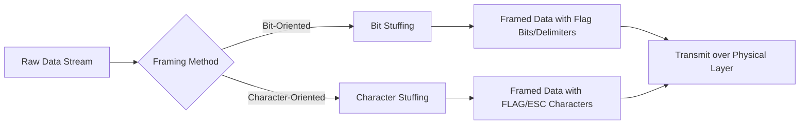
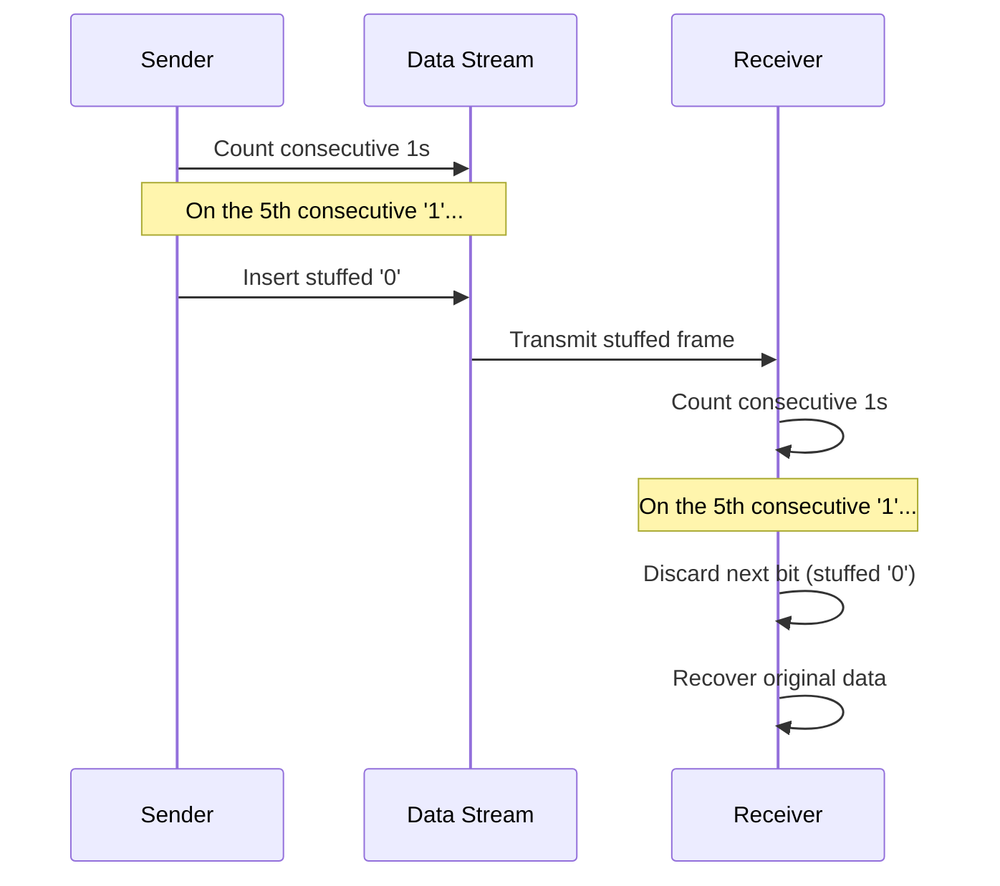
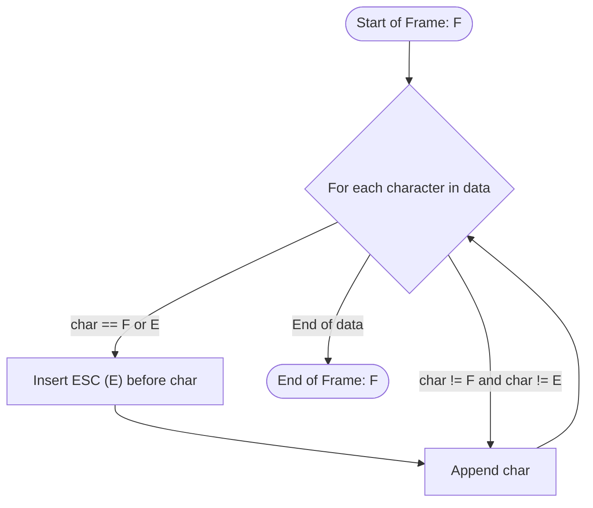

<div align="center">

# 🌐 Experiment 2 — Data Link Layer Framing

### Character Stuffing &nbsp;•&nbsp; Bit Stuffing

[](https://www.python.org/)
[](#)
[](#)
[](#)

</div>

[](https://raw.githubusercontent.com/andreasbm/readme/master/assets/lines/rainbow.gif)

# 🎯 Aim

To write and execute a program to implement Data Link Layer framing methods, namely:

1. Character Stuffing
2. Bit Stuffing

[](https://raw.githubusercontent.com/andreasbm/readme/master/assets/lines/rainbow.gif)

# 📝 Description

The **Data Link Layer** (Layer 2 of the OSI model) is responsible for the reliable transmission of data between two directly connected devices. Since raw data is transmitted as a continuous stream of bits, the Data Link Layer divides this stream into manageable units called **frames**.

To let the receiver know where one frame ends and the next begins, special **delimiter patterns** (control characters or bit sequences) are placed at the start and end of every frame. A problem arises when the delimiter pattern itself happens to occur naturally inside the data being transmitted — the receiver could mistake it for an actual frame boundary. **Framing (stuffing) techniques** solve this ambiguity by inserting extra bits or characters into the data stream, which are removed again at the receiver.

Two widely used framing methods are covered in this experiment:

| # | Method | Used In |
|---|--------|---------|
| 1️⃣ | **Bit Stuffing** | Bit-oriented protocols |
| 2️⃣ | **Character Stuffing** | Byte / character-oriented protocols |



[](https://raw.githubusercontent.com/andreasbm/readme/master/assets/lines/rainbow.gif)

## 1️⃣ Bit Stuffing

Bit stuffing is used in bit-oriented protocols (e.g., HDLC) where frames are delimited by a special bit pattern such as `01111110`. To ensure this exact pattern never appears accidentally inside the data, a **`0` is inserted after every sequence of five consecutive `1`s** in the data stream. The receiver reverses this process (bit unstuffing) by removing the inserted `0` whenever it follows five consecutive `1`s.

**📋 Click to view the Bit Stuffing Algorithm**

<details>
<summary>Bit Stuffing steps</summary>

1. Initialize a counter to `0`.
2. Traverse each bit of the input data:
   - If the current bit is `1`:
     1. Append it to the result.
     2. Increment the counter.
     3. If counter equals `5`, append a stuffed `0` to the result and reset the counter to `0`.
   - Else (bit is `0`):
     1. Append it to the result.
     2. Reset the counter to `0`.
3. Return the stuffed data.

</details>

**📋 Click to view the Bit Unstuffing Algorithm**

<details>
<summary>Bit Unstuffing steps</summary>

1. Initialize a counter to `0`.
2. Traverse each bit of the stuffed data:
   - If the bit is `1`, append it to the result and increment the counter. If the counter reaches `5`, skip the next bit (the stuffed `0`) and reset the counter.
   - If the bit is `0`, append it to the result and reset the counter.
3. Return the unstuffed data.

</details>



> 💻 **Full source code:** [`source_code1.py`](./source_code1.py)

[](https://raw.githubusercontent.com/andreasbm/readme/master/assets/lines/rainbow.gif)

## 2️⃣ Character Stuffing

Character stuffing is used in byte-oriented (character-oriented) protocols, where a special control character called **FLAG** marks the start and end of a frame. If the FLAG character (or the **ESCAPE** character used for stuffing) occurs naturally within the data, an ESCAPE character is inserted immediately before it so the receiver can distinguish real data from control sequences.

In this experiment:

| Symbol | Meaning |
|--------|---------|
| `F`    | FLAG — marks the start/end of a frame |
| `E`    | ESCAPE — inserted before an occurrence of FLAG or ESCAPE within the data |

**📋 Click to view the Character Stuffing Algorithm**

<details>
<summary>Character Stuffing steps</summary>

1. Initialize the result with the starting FLAG character (`F`).
2. Traverse each character of the input data:
   - If the character equals FLAG or ESC, append an ESC character to the result first.
   - Append the character itself to the result.
3. Append the closing FLAG character at the end.
4. Return the result.

</details>

**📋 Click to view the Character Unstuffing Algorithm**

<details>
<summary>Character Unstuffing steps</summary>

1. Ignore the first and last characters (the start and end FLAGs).
2. Traverse the data between them:
   - If the current character is ESC, move to the next character and append that character to the result.
   - Otherwise, append the current character directly.
3. Return the unstuffed data.

</details>



> 💻 **Full source code:** [`source_code2.py`](./source_code2.py)

[](https://raw.githubusercontent.com/andreasbm/readme/master/assets/lines/rainbow.gif)

## 🚀 Real-World Applications

| 🔤 Character Stuffing | 🔢 Bit Stuffing |
|:-----------------------|:------------------|
| Character-oriented communication protocols | HDLC (High-Level Data Link Control) |
| BISYNC (Binary Synchronous Communication) | PPP (Point-to-Point Protocol) |
| Text-based communication systems | USB communication |
| Serial communication | Wireless communication protocols |

[](https://raw.githubusercontent.com/andreasbm/readme/master/assets/lines/rainbow.gif)

# 📤 Output

> ⚠️ **Note:** The original PDF's *Output* section referenced a screenshot whose values were not extractable as text. The output below has been reconstructed by directly executing the exact program logic extracted from the PDF (see `source_code1.py` and `source_code2.py`) on the same sample inputs used in the PDF, so the values are guaranteed to match what the program produces.

**🔢 Bit Stuffing / Unstuffing**

```
Original Data:  11111011111101111
Stuffed Data:   1111100111110101111
Unstuffed Data: 11111011111101111
```

**🔤 Character Stuffing / Unstuffing**

```
Original Data:  ABCFDEFG
Stuffed Data:   FABCEFDEEEFGF
Unstuffed Data: ABCFDEFG
```

[](https://raw.githubusercontent.com/andreasbm/readme/master/assets/lines/rainbow.gif)

<div align="center">

### Made with ❤️ by **Thrinath**
📂 Part of the [`Sector5_Labs`](https://github.com/thrinathpolanki/Sector5_Labs) — Computer Networks Lab

</div>
