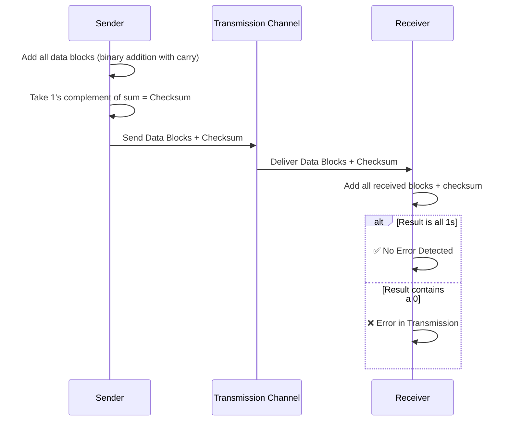

<div align="center">

# 🌐 Experiment 3 — Data Link Layer Framing: Checksum

### Error Detection • Sender-Receiver Simulation

[](https://www.python.org/)
[](#)
[](#)
[](#)

</div>

[](https://raw.githubusercontent.com/andreasbm/readme/master/assets/lines/rainbow.gif)

# 🎯 Aim

To write a Python program to implement the **Checksum** error detection technique used in the Data Link Layer for detecting errors during data transmission.

[](https://raw.githubusercontent.com/andreasbm/readme/master/assets/lines/rainbow.gif)

# 📝 Description

**Checksum** is an error-detection technique used in data communication. A calculated value — the checksum — is appended to the transmitted data so that the receiver can independently verify whether the data arrived without errors.

## 🧮 Basic Concept

1. Divide the binary data into equal-sized blocks (e.g., 8 bits each).
2. Add all the blocks together using **binary addition with carry**.
3. Take the **1's complement** of the resulting sum — this is the checksum.
4. Transmit all data blocks **plus** the checksum.
5. At the receiver, add all the received blocks **including** the checksum.
   - If the result is **all 1s** → no error detected.
   - If **any bit is 0** → an error occurred during transmission.



## ⚙️ Algorithm

**📋 Click to view the Sender-Side (Tx) Algorithm**

<details>
<summary>Checksum Calculation at Transmitter</summary>

**Input:** N binary data blocks of equal length
**Output:** Checksum

1. Initialize `checksum` = first data block.
2. For each remaining block, add it to `checksum` using binary addition with carry.
3. Take the 1's complement of the final sum.
4. Append this checksum to the data blocks for transmission.

</details>

**📋 Click to view the Receiver-Side (Rx) Algorithm**

<details>
<summary>Checksum Verification at Receiver</summary>

**Input:** Received data blocks + checksum
**Output:** Valid or Invalid transmission

1. Initialize `sum` = first data block.
2. For each remaining block (including the checksum), add it to `sum` using binary addition with carry.
3. If the final result contains only 1s → **Transmission is Valid**.
   Otherwise → **Error in Transmission**.

</details>

## 🔑 Key Functions

| Function | Purpose |
|----------|---------|
| `binary_addition(a, b)` | Adds two binary strings bit-by-bit with carry propagation, wrapping any end-around carry back into the result (1's-complement addition) |
| `ones_complement(binary_str)` | Flips every bit (`0 → 1`, `1 → 0`) to compute the 1's complement |
| `calculate_checksum(data_blocks)` | Sums all data blocks and returns the 1's complement as the checksum |
| `verify_checksum(data_blocks, received_checksum)` | Sums the received blocks with the received checksum and confirms the result is all 1s |

> 💻 **Full source code:** [`source_code.py`](./source_code.py)

[](https://raw.githubusercontent.com/andreasbm/readme/master/assets/lines/rainbow.gif)

## 🚀 Applications

- Detects errors during data transmission in computer networks.
- Used in **IP**, **TCP**, and **UDP** protocols for error detection.
- Used in wireless, IoT, and embedded system communications.
- Improves the reliability of digital communication systems.

[](https://raw.githubusercontent.com/andreasbm/readme/master/assets/lines/rainbow.gif)

# 📤 Output

> ⚠️ **Note:** The PDF's *Output* section had a heading but no legible captured values (likely an unextracted screenshot). Since the program is interactive (it reads the received blocks and checksum via `input()`), the output below was reconstructed by running the **exact extracted code** (`source_code.py`) and supplying the sender's own data blocks and calculated checksum as the receiver-side input — reproducing the intended "no error" demonstration implied by the PDF's algorithm and sample data.

**✅ Case 1 — Correct Data Received (no error)**

```
----------- SENDER SIDE -----------
Sender Data Blocks:
11010101
10101010
11110000
Calculated Checksum: 10001110

----------- RECEIVER SIDE -----------
Enter the received data blocks:
Enter Block 1: 11010101
Enter Block 2: 10101010
Enter Block 3: 11110000
Enter the received checksum: 10001110

Checking...
Data received correctly. No Error Detected.
```

**❌ Case 2 — Corrupted Data Received (error detected)**

```
----------- SENDER SIDE -----------
Sender Data Blocks:
11010101
10101010
11110000
Calculated Checksum: 10001110

----------- RECEIVER SIDE -----------
Enter the received data blocks:
Enter Block 1: 11010101
Enter Block 2: 10101011
Enter Block 3: 11110000
Enter the received checksum: 10001110

Checking...
Error in Data Transmission Detected.
```

[](https://raw.githubusercontent.com/andreasbm/readme/master/assets/lines/rainbow.gif)

<div align="center">

### Made with ❤️ by **Thrinath**
📂 Part of the [`Sector5_Labs`](https://github.com/thrinathpolanki/Sector5_Labs) — Computer Networks Lab

</div>
