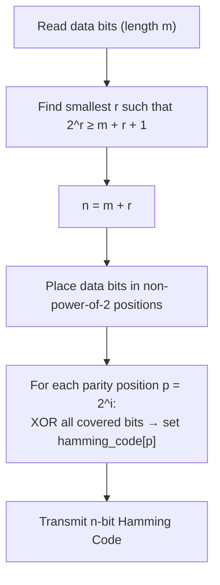

<div align="center">

# 🌐 Experiment 4 - Hamming Code

### Error Detection • Error Correction • Redundant Parity Bits

[](https://www.python.org/)
[](#)
[](#)
[](#)

</div>

[](https://raw.githubusercontent.com/andreasbm/readme/master/assets/lines/rainbow.gif)

# 🎯 Aim

To write and implement a program for **Hamming Code generation** to detect and correct a single-bit error in the transmitted data.

[](https://raw.githubusercontent.com/andreasbm/readme/master/assets/lines/rainbow.gif)

# 📝 Description

**Hamming Code** is an error-detecting *and* error-correcting technique used in digital communication and computer networks. Unlike simple parity or checksum schemes that can only *detect* an error, Hamming Code adds enough redundant (parity) bits to the original data bits that a **single-bit error** can be both detected **and precisely located and corrected** at the receiver.

## 🧮 How Many Parity Bits?

The number of redundant/parity bits `r` needed for `m` data bits is the smallest `r` satisfying:

$$2^r \ge m + r + 1$$

The total transmitted Hamming code length is then `n = m + r`.

Parity bits are always placed at positions that are **powers of two** (`1, 2, 4, 8, …`), and each parity bit is responsible for checking a specific subset of bit positions — the positions whose binary representation has that particular bit set.



## ⚙️ Algorithm

**📋 Click to view Part 1 — Hamming Code Generation**

<details>
<summary>Generation Algorithm</summary>

**Input:** Binary data bits (e.g., `1011`)
**Output:** Hamming Code with redundant parity bits

1. Read the binary data string `data_bits`.
2. Let `m` = length of `data_bits`.
3. Find the smallest `r` such that `2^r ≥ m + r + 1`.
4. Let `n = m + r` (total length of the Hamming code).
5. Create an array `hamming_code[1 .. n]`.
6. Place the data bits in every position that is **not** a power of two (`1, 2, 4, …` are reserved for parity).
7. For each parity position `p = 2^i`:
   - Initialize `parity = 0`.
   - For every position `j` from `1` to `n`: if `j & p != 0`, include `hamming_code[j]` in the parity (XOR) calculation.
   - Set `hamming_code[p] = parity % 2` (the XOR result).
8. Output the completed `hamming_code`.

</details>

**📋 Click to view Part 2 — Error Detection and Correction**

<details>
<summary>Detection & Correction Algorithm</summary>

**Input:** Received Hamming code
**Output:** Position of error (if any), and the corrected code

1. Read the received code as `received_code[1 .. n]`.
2. Initialize `error_position = 0`.
3. For each parity position `p = 2^i`:
   - Initialize `parity = 0`.
   - For every position `j` from `1` to `n`: if `j & p != 0`, include `received_code[j]` in the parity check.
   - If the resulting `parity != 0`, add `p` to `error_position`.
4. If `error_position == 0` → **no error**.
5. Otherwise → flip the bit at `error_position` in `received_code` (this corrects the single-bit error).
6. Output the corrected code.

</details>

> **Notes from the theory:** `&` is the bitwise AND operator; parity positions are `2^i → 1, 2, 4, 8, …`; XOR is used throughout for parity calculation.

## 🔑 Key Functions

| Function | Purpose |
|----------|---------|
| `calculate_parity_bits(data_bits)` | Builds the Hamming code: places data bits in non-power-of-2 positions, then computes each parity bit via XOR over its covered positions |
| `introduce_error(code, position)` | Flips a single bit at the given position — used to simulate a transmission error |
| `detect_error(received_code)` | Recomputes parity checks on the received code and returns the binary-sum position of any failing checks (0 = no error) |

> 💻 **Full source code:** [`source_code.py`](./source_code.py)
>
> ⚠️ **Correction applied:** The PDF's listing of `calculate_parity_bits` omitted the line defining `n` (used immediately afterward as `hamming_code = ['x'] * (n + 1)`), almost certainly lost during PDF text extraction. Per the algorithm's own Step 6 ("`n = m + r`, total length of the Hamming code"), the line `n = m + r` was restored immediately after the `r` calculation. This is the only change made to the code's logic; it was verified by executing the program against both example inputs from the PDF and confirming the output matches exactly (see Output below).

[](https://raw.githubusercontent.com/andreasbm/readme/master/assets/lines/rainbow.gif)

## 🚀 Applications

- Digital communication systems
- Radio communication
- Computer networks
- Optical communication
- Error-control coding systems

[](https://raw.githubusercontent.com/andreasbm/readme/master/assets/lines/rainbow.gif)

# 📤 Output

**✅ Case 1 — No error introduced**

```
Enter data bits (e.g., 1011): 1101
Enter position to introduce error (0 for none): 0
Generated Hamming Code: 1010101
No error detected.
```

**❌ Case 2 — Error introduced at position 2 (detected and located)**

```
Enter data bits (e.g., 1011): 1101
Enter position to introduce error (0 for none): 2
Generated Hamming Code: 1010101
Hamming Code with error introduced: 1110101
Error detected at position: 2
```

[](https://raw.githubusercontent.com/andreasbm/readme/master/assets/lines/rainbow.gif)

<div align="center">

### Made with ❤️ by **Thrinath**
📂 Part of the [`Sector5_Labs`](https://github.com/thrinathpolanki/Sector5_Labs) — Computer Networks Lab

</div>
