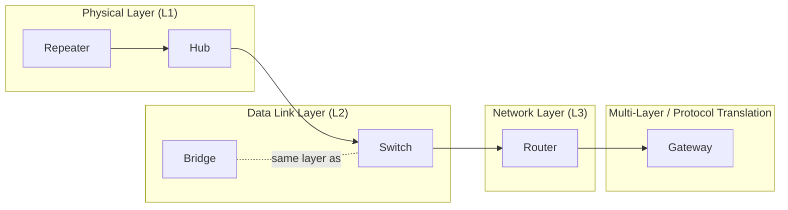
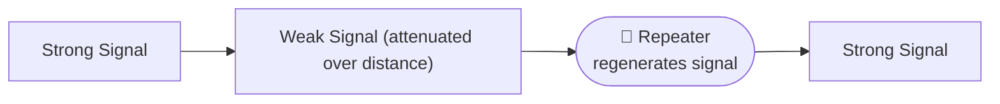
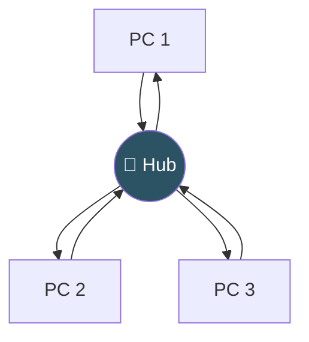
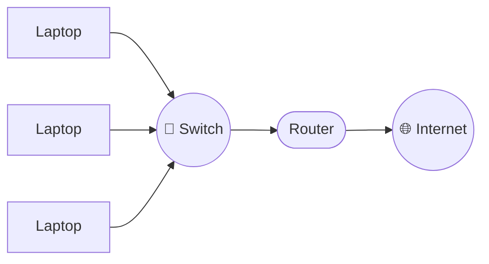
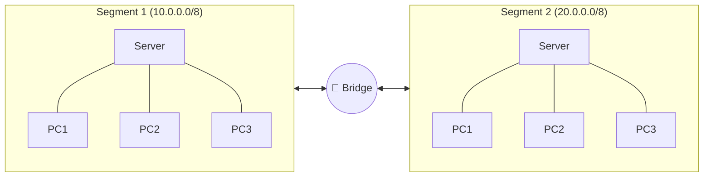
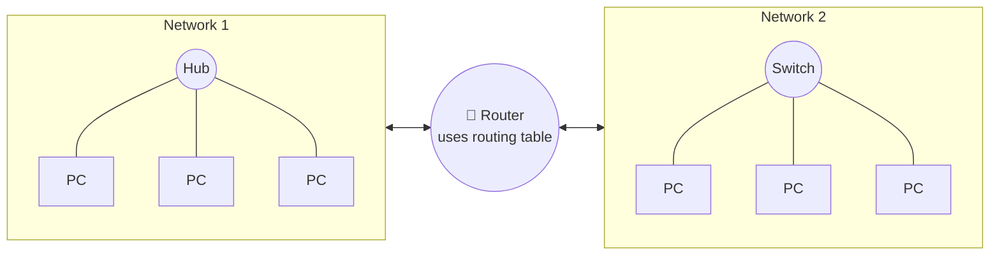
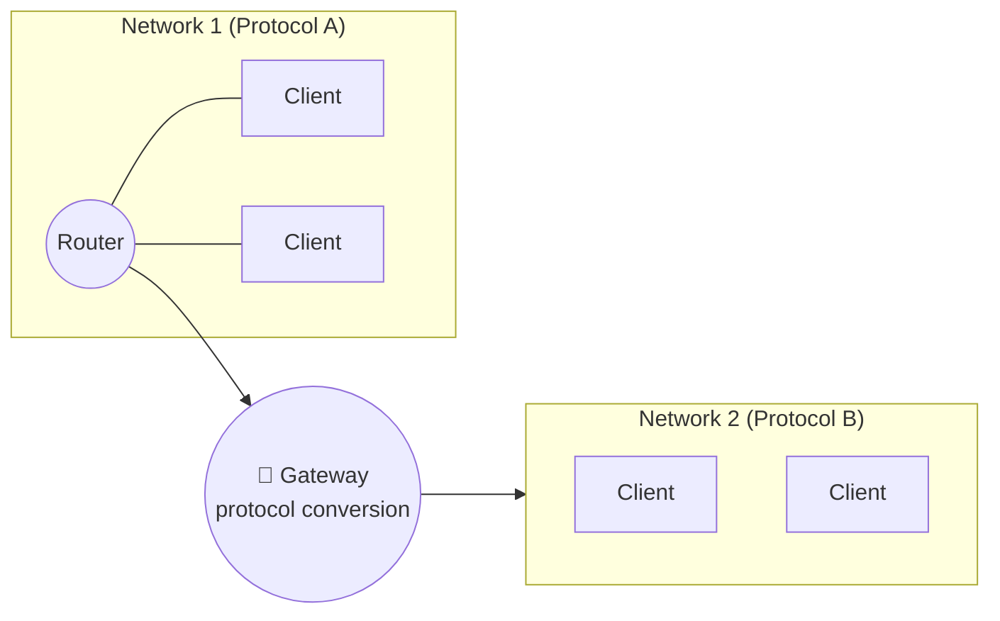
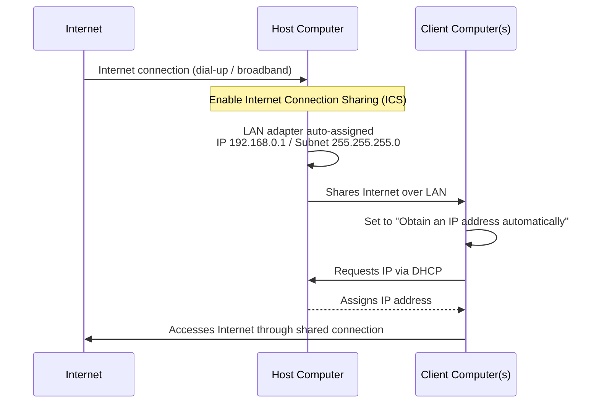

# 🌐 Experiment 1 — Network Devices & LAN Setup

### Repeater • Hub • Switch • Bridge • Router • Gateway • Internet Connection Sharing

# 🎯 Aim

1. Study of Network devices in detail.
2. Connect the computers in a Local Area Network (LAN) and share the Internet connection from the host computer with client computers.

# 📝 Description

## 🧩 Part A — Study of Network Devices

Networking hardware can be organized by **which OSI layer it operates at** and **how "intelligently" it forwards traffic** — from a device that simply amplifies a signal, all the way up to one that can translate between entirely different protocols.

### 📡 1. Repeater

A repeater receives a **weak signal**, regenerates it at higher power, and retransmits it to extend the communication distance. It has **two ports** and simply connects two network segments — it does not interpret or filter any data.

### 🔌 2. Hub

An **Ethernet Hub** is a multiport repeater that connects multiple Ethernet devices into a single network segment.

| Property | Detail |
|----------|--------|
| OSI Layer | Physical Layer (Layer 1) |
| Behavior | Receives and regenerates signals, then **broadcasts** them to *all* connected ports |
| Collisions | On collision, sends a **jam signal** to all devices, which then retransmit after a random backoff period |

### 🔀 3. Switch

A **network switch** connects multiple devices or network segments and mainly operates at the **Data Link Layer (Layer 2)**.

- Examines the **destination MAC address** of each incoming frame.
- Forwards the frame **only to the appropriate port** (instead of broadcasting), reducing unnecessary traffic and improving efficiency.
- **Layer 3 switches** can additionally perform routing functions for larger networks.

### 🌉 4. Bridge

A **network bridge** connects multiple network segments and also operates at the **Data Link Layer (Layer 2)**. It examines incoming frames and forwards or filters them based on MAC addresses, reducing unnecessary traffic.

> A switch is essentially a **multiport bridge** — the two terms are often used interchangeably.

### 🧭 5. Router

A **router** connects two or more networks and operates at the **Network Layer (Layer 3)**. It examines the **destination IP address** of packets and forwards them along the best path, using **routing tables** to make that decision.

### 🚪 6. Gateway

A **gateway** connects two or more networks that use **different communication protocols** and enables them to communicate by performing **protocol conversion**. It ensures interoperability between dissimilar networks and may include protocol translators, rate converters, or signal translators.

## 🔑 Device Comparison

| Device | OSI Layer | Forwarding Decision | Ports |
|--------|-----------|----------------------|-------|
| **Repeater** | Physical (L1) | None — regenerates signal only | 2 |
| **Hub** | Physical (L1) | None — broadcasts to all ports | Multiple |
| **Switch** | Data Link (L2) | Destination MAC address | Multiple |
| **Bridge** | Data Link (L2) | Destination MAC address | 2 (segments) |
| **Router** | Network (L3) | Destination IP address (routing table) | Multiple networks |
| **Gateway** | Multi-layer | Protocol translation | Dissimilar networks |

## 🖧 Part B — Connecting Computers in a LAN & Sharing the Internet

**Aim of this part:** connect computers in a Local Area Network (LAN) and share the Internet connection from the **host computer** with **client computers**, using **Internet Connection Sharing (ICS)**.

**📋 Click to view the Host-Computer Setup Procedure (Enable ICS)**

Steps on the Host Computer

1. Log on to the host computer as an **Administrator** or **Owner**.
2. Click **Start**, then click **Control Panel**.
3. Click **Network and Internet Connections**.
4. Click **Network Connections**.
5. Right-click the Internet connection to share (dial-up, broadband, or other network connection), then click **Properties**.
6. Click the **Advanced** tab.
7. Under **Internet Connection Sharing**, select **Allow other network users to connect through this computer's Internet connection**.
8. If sharing a dial-up connection, optionally select **Establish a dial-up connection whenever a computer on my network attempts to access the Internet**.
9. Click **OK**.

A confirmation message appears, warning that:

> When Internet Connection Sharing is enabled, your LAN adapter will be set to use the IP address `192.168.0.1`. Your computer may lose connectivity with other computers on your network. If these other computers have static IP addresses, it is a good idea to set them to obtain their IP addresses automatically. Are you sure you want to enable Internet Connection Sharing?

10. Click **Yes**.

Once enabled, the Internet connection is shared with all other computers on the LAN. The host's LAN adapter is automatically assigned:

| Setting | Value |
|---------|-------|
| **IP Address** | `192.168.0.1` |
| **Subnet Mask** | `255.255.255.0` |

**📋 Click to view the Client-Computer Setup Procedure**

Steps on the Client Computer

1. Ensure the LAN adapter is connected to the host computer.
2. Open **Control Panel → Network and Internet Connections → Network Connections**.
3. Right-click **Local Area Connection** and select **Properties**.
4. Select **Internet Protocol (TCP/IP)** or **Internet Protocol Version 4 (TCP/IPv4)**, then click **Properties**.
5. Select **Obtain an IP address automatically**.
6. Select **Obtain DNS server address automatically**.
7. Click **OK**, and close all dialog boxes.
8. Restart the computer if prompted.

# 📤 Output

> ℹ️ **Note:** This experiment is a hardware/OS-configuration study rather than a program — there is no source code and no console/program output in the PDF. The PDF instead states the practical result of following the procedure, reproduced below.

Once the setup is complete:

- The **host computer's** LAN adapter is automatically configured with **IP Address `192.168.0.1`** and **Subnet Mask `255.255.255.0`**.
- The **client computer** automatically receives an IP address from the host computer (via DHCP, once set to "Obtain an IP address automatically").
- The client computer is then able to **access the Internet through the shared connection**, confirming that the LAN has been successfully set up with Internet Connection Sharing.

### Made with ❤️ by **Thrinath**
📂 Part of the [`Sector5_Labs`](https://github.com/thrinathpolanki/Sector5_Labs) — Computer Networks Lab

