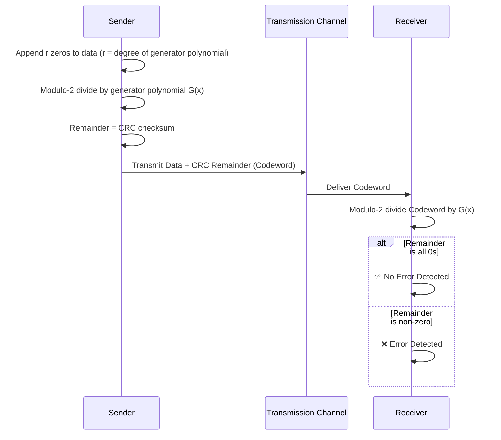

<div align="center">

# 🌐 Experiment 5 — Cyclic Redundancy Check (CRC)

### CRC-12 • CRC-16 • CRC-CCITT

[](https://www.python.org/)
[](#)
[](#)
[](#)

[](https://github.com/thrinathpolanki/Sector5_Labs/tree/main/Computer-Networks-Lab/Experiment-05-Cyclic-Redundancy-Check-(CRC))

📂 [`Experiment-05-Cyclic-Redundancy-Check-(CRC)`](https://github.com/thrinathpolanki/Sector5_Labs/tree/main/Computer-Networks-Lab/Experiment-05-Cyclic-Redundancy-Check-(CRC))

</div>

[](https://raw.githubusercontent.com/andreasbm/readme/master/assets/lines/rainbow.gif)

# 🎯 Aim

To write and implement a program to calculate and verify the **Cyclic Redundancy Check (CRC)** for a given data set of characters using three CRC generator polynomials — **CRC-12**, **CRC-16**, and **CRC-CCITT** — and to detect errors in the transmitted data.

[](https://raw.githubusercontent.com/andreasbm/readme/master/assets/lines/rainbow.gif)

# 📝 Description

**CRC** is an error-detection technique used in data communication and computer networks to catch errors introduced during transmission. It is based on **polynomial arithmetic over modulo-2 (binary) arithmetic**, where addition and subtraction are both performed using the **XOR** operation.

The sender and receiver agree in advance on a **generator polynomial**. For a generator polynomial of degree `r`, the sender appends `r` zeros to the data and performs modulo-2 division by the generator polynomial; the **remainder** of this division is the CRC checksum, which is appended to the data to form the transmitted codeword.

$$\text{Transmitted Codeword} = \text{Data} + \text{CRC Remainder}$$

At the receiver, the **entire received codeword** is divided by the same generator polynomial:

- Remainder is **zero** → no detectable error.
- Remainder is **non-zero** → error detected.



## 🧬 Generator Polynomials Used

| Standard | Polynomial G(x) | Bit Pattern |
|----------|------------------|-------------|
| **CRC-12** | $x^{12}+x^{11}+x^3+x^2+x+1$ | `1100000001111` |
| **CRC-16** | $x^{16}+x^{15}+x^2+1$ | `11000000000000101` |
| **CRC-CCITT** | $x^{16}+x^{12}+x^5+1$ | `10001000000100001` |

## ⚙️ Algorithm

**📋 Click to view Part 1 — Sender-Side CRC Generation**

<details>
<summary>Encoding Algorithm</summary>

1. Read the binary input `data` and `key` (generator polynomial).
2. Append `(n − 1)` zeros to the data, where `n = len(key)`:
   `appended_data = data + '0' * (n - 1)`
3. Initialize `tmp` with the first `n` bits of `appended_data`.
4. Repeat until all bits of `appended_data` are processed:
   - If the first bit of `tmp` is `1` → `tmp = XOR(tmp, key) + next bit`
   - Else → `tmp = XOR(tmp, '0'*n) + next bit`
   - Discard the first bit of `tmp` to maintain size `n`.
5. After the loop, perform one final XOR:
   - If the first bit of `tmp` is `1` → `tmp = XOR(tmp, key)`
   - Else → `tmp = XOR(tmp, '0'*n)`
6. The resulting `tmp` is the **remainder (CRC)**.
7. Final transmitted codeword = `data + remainder`.

</details>

**📋 Click to view Part 2 — Receiver-Side CRC Verification**

<details>
<summary>Verification Algorithm</summary>

1. Initialize `tmp` with the first `n` bits of the `received_codeword`.
2. Repeat modulo-2 division exactly as on the sender side, shifting left (discarding the first bit) each round.
3. After the loop, perform one final XOR as before.
4. Check the final remainder (`tmp`):
   - All `0`s → **No Error**.
   - Otherwise → **Error Detected**.

</details>

## 🔑 Key Functions

| Function | Purpose |
|----------|---------|
| `xor(a, b)` | Performs bitwise XOR between two binary strings, dropping the leading bit of the result (standard modulo-2 division step) |
| `mod2div(dividend, divisor)` | Performs the full modulo-2 (binary) long division that produces the CRC remainder |
| `encodeData(data, key)` | Sender-side: zero-pads the data, computes the CRC remainder, and forms the transmitted codeword |
| `checkData(received_codeword, key)` | Receiver-side: re-divides the received codeword by the key and reports whether an error was detected |

> 💻 **Full source code:** [`source_code.py`](./source_code.py)

[](https://raw.githubusercontent.com/andreasbm/readme/master/assets/lines/rainbow.gif)

## 🚀 Applications

- Error detection in Ethernet, Wi-Fi, and other data-link layer protocols.
- Integrity verification in file transfer and storage systems.
- Used in ZIP, PNG, and other file formats for corruption checks.
- Communication protocols requiring high error-detection reliability (e.g., HDLC, USB, Bluetooth).

[](https://raw.githubusercontent.com/andreasbm/readme/master/assets/lines/rainbow.gif)

# 📤 Output

> ⚠️ **Note:** The PDF's *Output* section had a heading but no captured values (likely an unextracted screenshot). Since the program is interactive and driven by `input()`, the output below was reconstructed by executing the **exact extracted code** (`source_code.py`) with a representative 10-bit data sample against all three generator polynomials specified in the experiment, including one deliberately corrupted case to demonstrate error detection.

**✅ CRC-12 — No Error**

```
Enter the data bits: 1101011011
Enter the generator polynomial (key): 1100000001111

--- Sender Side ---
Original Data:  1101011011
Generator Key:  1100000001111
CRC Remainder:  110001100100
Transmitted Code:  1101011011110001100100

--- Receiver Side ---
Enter the received codeword: 1101011011110001100100
Received Codeword:  1101011011110001100100
No Error Detected
```

**❌ CRC-12 — Error Detected (last bit corrupted)**

```
Enter the data bits: 1101011011
Enter the generator polynomial (key): 1100000001111

--- Sender Side ---
Original Data:  1101011011
Generator Key:  1100000001111
CRC Remainder:  110001100100
Transmitted Code:  1101011011110001100100

--- Receiver Side ---
Enter the received codeword: 1101011011110001100101
Received Codeword:  1101011011110001100101
Error Detected
```

**✅ CRC-16 — No Error**

```
Enter the data bits: 1101011011
Enter the generator polynomial (key): 11000000000000101

--- Sender Side ---
Original Data:  1101011011
Generator Key:  11000000000000101
CRC Remainder:  1000101111011001
Transmitted Code:  11010110111000101111011001

--- Receiver Side ---
Enter the received codeword: 11010110111000101111011001
Received Codeword:  11010110111000101111011001
No Error Detected
```

**✅ CRC-CCITT — No Error**

```
Enter the data bits: 1101011011
Enter the generator polynomial (key): 10001000000100001

--- Sender Side ---
Original Data:  1101011011
Generator Key:  10001000000100001
CRC Remainder:  1011111011001101
Transmitted Code:  11010110111011111011001101

--- Receiver Side ---
Enter the received codeword: 11010110111011111011001101
Received Codeword:  11010110111011111011001101
No Error Detected
```

[](https://raw.githubusercontent.com/andreasbm/readme/master/assets/lines/rainbow.gif)

<div align="center">

### Made with ❤️ by **Thrinath**
📂 Part of the [`Sector5_Labs`](https://github.com/thrinathpolanki/Sector5_Labs) — Computer Networks Lab

</div>
