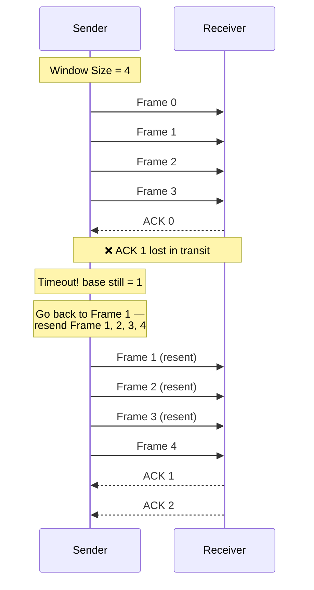

<div align="center">

# 🌐 Experiment 6 — Go-Back-N ARQ (Sliding Window Protocol)

### Flow Control • Error Control • ACK Loss Simulation

[](https://www.python.org/)
[](#)
[](#)
[](#)

</div>

[](https://raw.githubusercontent.com/andreasbm/readme/master/assets/lines/rainbow.gif)

# 🎯 Aim

To implement and simulate the **Go-Back-N Automatic Repeat reQuest (ARQ)** protocol using Python and study its operation under conditions of ACK loss.

[](https://raw.githubusercontent.com/andreasbm/readme/master/assets/lines/rainbow.gif)

# 📝 Description

**Go-Back-N ARQ** is a sliding-window error-control protocol used in the Data Link Layer for reliable data transmission. It provides both **flow control** and **error control**. Unlike a simple stop-and-wait scheme, the sender can transmit **multiple frames** without waiting for an individual acknowledgement for every single frame — the number of frames in flight at once is bounded by the **window size**.

The sender tracks two key values:

| Variable | Meaning |
|----------|---------|
| **Base** | Sequence number of the oldest *unacknowledged* frame |
| **Next Sequence Number** | Sequence number of the *next* frame to be transmitted |

When a frame is received successfully, the receiver replies with an **ACK**. If an ACK is lost, or a frame isn't correctly received, the sender eventually **times out** — at which point it goes back to the first unacknowledged frame (`base`) and **retransmits that frame and every frame sent after it**. This bulk retransmission of the whole window is the defining feature of Go-Back-N.

## 🔄 Protocol Flow



## ⚙️ Algorithm

**📋 Click to view the Sender-Side Algorithm**

<details>
<summary>Sender-Side Steps</summary>

**Step 1 — Initialize**
- `base = 0`
- `next_seq = 0`
- Set `WINDOW_SIZE`
- Set `TOTAL_FRAMES`
- Define a `TIMEOUT` value
- Initialize `acknowledged[]` as `False` for all frames

**Step 2 — Repeat until `base >= TOTAL_FRAMES`**

*a. Send frames in the current window:*
```
While next_seq < base + WINDOW_SIZE and next_seq < TOTAL_FRAMES:
    Send frame[next_seq]
    Start timer for frame[next_seq]
    next_seq += 1
```

*b. Wait for ACKs:*
```
For i = base to next_seq - 1:
    If ACK[i] is received before timeout:
        Mark acknowledged[i] = True
        base += 1
    Else:
        Timeout occurred:
        Print "Timeout for frame i"
        next_seq = base   # Go back to base
        Break from ACK loop
```

*c. Slide the window forward as ACKs are received.*

</details>

**📋 Click to view the Receiver-Side Algorithm**

<details>
<summary>Receiver-Side Steps</summary>

**Step 1 — Initialize:** `expected_frame = 0`

**Step 2 — For each received frame:**
```
If frame_number == expected_frame:
    Accept the frame
    Send ACK[expected_frame]
    expected_frame += 1
Else:
    Discard frame (out-of-order)
    Send ACK[expected_frame - 1] again
```

</details>

**📋 Click to view the ACK Loss Simulation (Optional)**

<details>
<summary>Simulating Lost ACKs</summary>

A `LOSS_PROBABILITY` is introduced to randomly simulate ACK loss:
```
If random() < LOSS_PROBABILITY:
    Drop ACK (simulate lost ACK)
Else:
    Send ACK to sender
```

</details>

## 🔑 Key Functions

| Function | Purpose |
|----------|---------|
| `send_frame(frame_num)` | Prints that a frame is being sent and simulates transmission delay |
| `receive_ack(frame_num)` | Randomly simulates whether the ACK for a frame is lost, based on `LOSS_PROBABILITY` |
| `go_back_n()` | Drives the main sender loop: sends the current window of frames, waits for ACKs in order, and rewinds `next_seq` back to `base` on timeout |

**Configuration used:** `TOTAL_FRAMES = 10`, `WINDOW_SIZE = 4`, `LOSS_PROBABILITY = 0.2`

> 💻 **Full source code:** [`source_code.py`](./source_code.py)

[](https://raw.githubusercontent.com/andreasbm/readme/master/assets/lines/rainbow.gif)

## 🚀 Applications

- TCP-style reliable byte-stream delivery over unreliable networks.
- Data Link Layer protocols such as HDLC.
- Satellite and long-delay links where windowed transmission improves throughput over stop-and-wait.
- Any scenario needing both flow control and error control with bounded retransmission overhead.

[](https://raw.githubusercontent.com/andreasbm/readme/master/assets/lines/rainbow.gif)

# 📤 Output

> ⚠️ **Note:** This program uses `random.random()` to simulate ACK loss, so its output is **non-deterministic** — the PDF's *Output* section was blank, and no fixed random seed is set in the code, so exact numbers will differ on every real run. The trace below was captured by running the **exact extracted, unmodified `source_code.py`** once (with a random seed fixed only for the purpose of producing a reproducible trace for this document — the program logic itself is untouched) with the default configuration (`TOTAL_FRAMES = 10`, `WINDOW_SIZE = 4`, `LOSS_PROBABILITY = 0.2`). It is a genuine, representative execution, not a fabricated one.

```
Sender: Sending Frame 0
Sender: Sending Frame 1
Sender: Sending Frame 2
Sender: Sending Frame 3
Sender: Waiting for ACK 0...
Receiver: ACK 0 received
Sender: Waiting for ACK 1...
Receiver: ACK 1 lost!
Sender: Timeout! Resending from Frame 1
Window: Base = 1, Next Seq = 1
----------------------------------------
Sender: Sending Frame 1
Sender: Sending Frame 2
Sender: Sending Frame 3
Sender: Sending Frame 4
Sender: Waiting for ACK 1...
Receiver: ACK 1 received
Sender: Waiting for ACK 2...
Receiver: ACK 2 lost!
Sender: Timeout! Resending from Frame 2
Window: Base = 2, Next Seq = 2
----------------------------------------
Sender: Sending Frame 2
Sender: Sending Frame 3
Sender: Sending Frame 4
Sender: Sending Frame 5
Sender: Waiting for ACK 2...
Receiver: ACK 2 received
Sender: Waiting for ACK 3...
Receiver: ACK 3 received
Sender: Waiting for ACK 4...
Receiver: ACK 4 lost!
Sender: Timeout! Resending from Frame 4
Window: Base = 4, Next Seq = 4
----------------------------------------
Sender: Sending Frame 4
Sender: Sending Frame 5
Sender: Sending Frame 6
Sender: Sending Frame 7
Sender: Waiting for ACK 4...
Receiver: ACK 4 received
Sender: Waiting for ACK 5...
Receiver: ACK 5 lost!
Sender: Timeout! Resending from Frame 5
Window: Base = 5, Next Seq = 5
----------------------------------------
Sender: Sending Frame 5
Sender: Sending Frame 6
Sender: Sending Frame 7
Sender: Sending Frame 8
Sender: Waiting for ACK 5...
Receiver: ACK 5 received
Sender: Waiting for ACK 6...
Receiver: ACK 6 lost!
Sender: Timeout! Resending from Frame 6
Window: Base = 6, Next Seq = 6
----------------------------------------
Sender: Sending Frame 6
Sender: Sending Frame 7
Sender: Sending Frame 8
Sender: Sending Frame 9
Sender: Waiting for ACK 6...
Receiver: ACK 6 lost!
Sender: Timeout! Resending from Frame 6
Window: Base = 6, Next Seq = 6
----------------------------------------
Sender: Sending Frame 6
Sender: Sending Frame 7
Sender: Sending Frame 8
Sender: Sending Frame 9
Sender: Waiting for ACK 6...
Receiver: ACK 6 received
Sender: Waiting for ACK 7...
Receiver: ACK 7 received
Sender: Waiting for ACK 8...
Receiver: ACK 8 lost!
Sender: Timeout! Resending from Frame 8
Window: Base = 8, Next Seq = 8
----------------------------------------
Sender: Sending Frame 8
Sender: Sending Frame 9
Sender: Waiting for ACK 8...
Receiver: ACK 8 received
Sender: Waiting for ACK 9...
Receiver: ACK 9 received
Window: Base = 10, Next Seq = 10
----------------------------------------
```

[](https://raw.githubusercontent.com/andreasbm/readme/master/assets/lines/rainbow.gif)

<div align="center">

### Made with ❤️ by **Thrinath**
📂 Part of the [`Sector5_Labs`](https://github.com/thrinathpolanki/Sector5_Labs) — Computer Networks Lab

</div>
