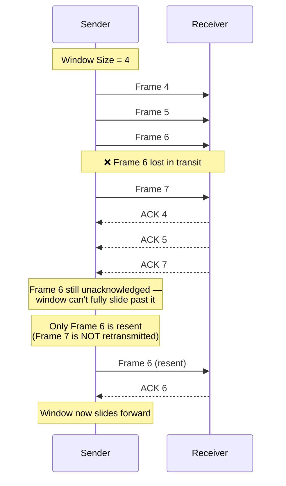

<div align="center">

# 🌐 Experiment 7 — Selective Repeat ARQ (Sliding Window Protocol)

### Flow Control • Error Control • Selective Frame Retransmission

[](https://www.python.org/)
[](#)
[](#)
[](#)

</div>

[](https://raw.githubusercontent.com/andreasbm/readme/master/assets/lines/rainbow.gif)

# 🎯 Aim

To write and execute a program to implement the **Sliding Window Protocol using Selective Repeat ARQ**, and demonstrate the retransmission of **only** the lost or erroneous frames.

[](https://raw.githubusercontent.com/andreasbm/readme/master/assets/lines/rainbow.gif)

# 📝 Description

The **Sliding Window Protocol** is a flow-control and error-control mechanism used in computer networks. It lets the sender transmit multiple frames before waiting for acknowledgements — the number of frames in flight at once is governed by the **window size**.

**Selective Repeat ARQ (Automatic Repeat reQuest)** is a sliding-window protocol for reliable data transmission where:

- The receiver can **accept and buffer frames that arrive out of order**.
- **Each frame is acknowledged individually.**
- If a frame is lost or corrupted, the receiver simply does not acknowledge it.
- The sender retransmits **only that lost/erroneous frame** — *not* every frame that follows it, unlike Go-Back-N.

This selective retransmission is what distinguishes Selective Repeat from Go-Back-N ARQ, and it makes far more efficient use of bandwidth when losses are infrequent.

## 🔄 Protocol Flow



## ⚙️ Algorithm

**📋 Click to view the full Selective Repeat Algorithm**

<details>
<summary>Step-by-Step Algorithm</summary>

**Step 1 — Initialization**
1. Set total number of frames: `TOTAL_FRAMES`.
2. Set window size: `WINDOW_SIZE`.
3. Initialize sender window status array: `sender_window[0 .. TOTAL_FRAMES-1] = False`.
4. Initialize receiver buffer: `receiver_window[0 .. TOTAL_FRAMES-1] = None`.
5. Set `base = 0` (index of the first frame in the sender's window).

**Step 2 — Repeat until all frames are acknowledged**

While `base < TOTAL_FRAMES`:

1. Set `end = min(base + WINDOW_SIZE, TOTAL_FRAMES)` (last index in the current window).

**Step 3 — Send frames in the current window**

For each `i` in range `base` to `end - 1`:
- If `sender_window[i] == False` (not yet acknowledged):
  - Send frame `i`.
  - Simulate random loss: if not lost, store it in `receiver_window[i]`; else mark as lost (no change to the receiver buffer).

**Step 4 — Process ACKs**

For each `i` in range `base` to `end - 1`:
- If `receiver_window[i]` is not `None` and `sender_window[i] == False` → assume ACK received, set `sender_window[i] = True`.
- Else → ACK not yet received, or the frame was lost.

**Step 5 — Slide the sender window**

While `sender_window[base] == True` and `base < TOTAL_FRAMES`: increment `base` by 1.

**Step 6 — Repeat** from Step 2 until `base == TOTAL_FRAMES`.

**Step 7 — End:** Display *"All frames successfully transmitted and acknowledged."*

</details>

## 🔑 Key Components

| Component | Purpose |
|-----------|---------|
| `sender_window[]` | Tracks whether each frame has been acknowledged (`True`) or not (`False`) |
| `receiver_window[]` | Tracks whether the receiver has actually received each frame (`None` = not yet received) |
| `selective_repeat_protocol()` | Drives the simulation: sends unacknowledged frames in the current window, simulates random loss, processes ACKs, and slides the window forward only past consecutively acknowledged frames |

**Configuration used:** `TOTAL_FRAMES = 10`, `WINDOW_SIZE = 4`, `LOSS_PROBABILITY = 0.3`, `DELAY = 0.8s`

> 💻 **Full source code:** [`source_code.py`](./source_code.py)

[](https://raw.githubusercontent.com/andreasbm/readme/master/assets/lines/rainbow.gif)

## 🚀 Applications

- Wireless and satellite links, where selective retransmission saves significant bandwidth over long, lossy channels.
- TCP with Selective Acknowledgement (SACK) extension.
- Any protocol requiring efficient recovery from occasional, isolated frame loss without penalizing already-delivered frames.

[](https://raw.githubusercontent.com/andreasbm/readme/master/assets/lines/rainbow.gif)

# 📤 Output

> ⚠️ **Note:** This program uses `random.random()` to simulate frame loss with **no fixed seed**, so its output is **non-deterministic** — the PDF's *Output* section was blank. The trace below was captured by running the **exact extracted, unmodified `source_code.py`** once (with a random seed fixed only externally to produce a reproducible trace for this document — the program's logic itself was not touched). It is a genuine, representative execution that clearly shows Frame 6 being lost, only Frame 6 being resent, and the window sliding forward once it's acknowledged.

```
=== Selective Repeat Sliding Window Protocol ===

Sender Window: [0 to 3]
Sending Frame 0... Delivered.
Sending Frame 1... Delivered.
Sending Frame 2... Delivered.
Sending Frame 3... Delivered.
ACK received for Frame 0
ACK received for Frame 1
ACK received for Frame 2
ACK received for Frame 3
----------------------------------------
Sender Window: [4 to 7]
Sending Frame 4... Delivered.
Sending Frame 5... Delivered.
Sending Frame 6... Lost.
Sending Frame 7... Delivered.
ACK received for Frame 4
ACK received for Frame 5
Waiting for ACK: Frame 6
ACK received for Frame 7
----------------------------------------
Sender Window: [6 to 9]
Sending Frame 6... Delivered.
Sending Frame 8... Delivered.
Sending Frame 9... Lost.
ACK received for Frame 6
ACK received for Frame 8
Waiting for ACK: Frame 9
----------------------------------------
Sender Window: [9 to 9]
Sending Frame 9... Delivered.
ACK received for Frame 9
----------------------------------------

All frames successfully transmitted and acknowledged.
```

[](https://raw.githubusercontent.com/andreasbm/readme/master/assets/lines/rainbow.gif)

<div align="center">

### Made with ❤️ by **Thrinath**
📂 Part of the [`Sector5_Labs`](https://github.com/thrinathpolanki/Sector5_Labs) — Computer Networks Lab

</div>
