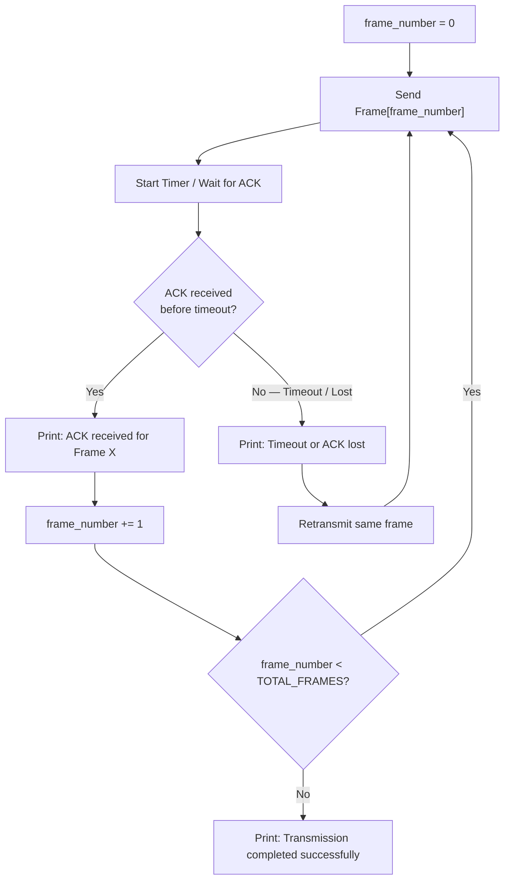

<div align="center">

# 🌐 Experiment 8 — Stop-and-Wait Protocol

### Flow Control • Error Control • Frame & ACK Loss Simulation

[](https://www.python.org/)
[](#)
[](#)
[](#)

</div>

[](https://raw.githubusercontent.com/andreasbm/readme/master/assets/lines/rainbow.gif)

# 🎯 Aim

To write a program to implement the **Stop-and-Wait Protocol** for reliable data transmission between sender and receiver.

[](https://raw.githubusercontent.com/andreasbm/readme/master/assets/lines/rainbow.gif)

# 📝 Description

The **Stop-and-Wait Protocol** is the simplest flow-control and error-control protocol used for reliable data transmission. Unlike sliding-window protocols (Go-Back-N, Selective Repeat), the sender transmits **exactly one frame at a time** and then **waits** for an acknowledgment (ACK) from the receiver before sending the next frame — there is no windowing or pipelining at all.

If the ACK doesn't arrive before a timeout (because either the **frame** or the **ACK itself** was lost), the sender simply **retransmits the same frame** and waits again, repeating until it's finally acknowledged.



## ⚙️ Algorithm

**📋 Click to view the Stop-and-Wait Algorithm**

<details>
<summary>Step-by-Step Algorithm</summary>

**Step 1 — Initialize**
- Set `frame_number = 0`.
- Set `TOTAL_FRAMES = N`.

**Step 2 — Repeat until all frames are sent** (`frame_number < TOTAL_FRAMES`):
1. Send the frame with `frame_number` to the receiver.
2. Start a timer for the acknowledgment.
3. Wait for an acknowledgment (ACK):
   - **If the ACK is received before timeout:** print `"ACK received for frame X"` and increment `frame_number` to move to the next frame.
   - **If the ACK is not received** (timeout or loss): print `"Timeout or ACK lost"` and retransmit the same frame.
4. Repeat the process for the same frame until the ACK is received.

**Step 3 —** After all frames are acknowledged, print `"Transmission completed successfully."`

**Step 4 —** Stop.

</details>

## 🔑 Key Functions

| Function | Purpose |
|----------|---------|
| `send_frame(frame_number)` | Simulates sending one frame: randomly simulates **frame loss**, and — if the frame was delivered — randomly simulates **ACK loss** on the way back. Returns `True` only if both the frame and its ACK survive |
| `stop_and_wait()` | Drives the main loop: repeatedly calls `send_frame()` for the current frame, advancing only on success and retransmitting (with a timeout delay) on any kind of loss |

**Configuration used:** `TOTAL_FRAMES = 5`, `LOSS_PROBABILITY = 0.2`, `TIMEOUT_DELAY = 1.0s`

> 💻 **Full source code:** [`source_code.py`](./source_code.py)

[](https://raw.githubusercontent.com/andreasbm/readme/master/assets/lines/rainbow.gif)

## 🚀 Applications

- Simple, low-overhead links where only one frame needs to be outstanding at a time (e.g., very short-distance or low-bandwidth links).
- Foundational building block for understanding more advanced protocols like Go-Back-N and Selective Repeat.
- Used conceptually in protocols like TFTP and some early serial communication links.

[](https://raw.githubusercontent.com/andreasbm/readme/master/assets/lines/rainbow.gif)

# 📤 Output

> ⚠️ **Note:** This program uses `random.random()` to simulate both frame loss and ACK loss with **no fixed seed**, so its output is **non-deterministic** — the PDF's *Output* section was blank. The trace below was captured by running the **exact extracted, unmodified `source_code.py`** once (with a random seed fixed only externally to produce a reproducible trace for this document — the program's logic itself was not touched). It is a genuine, representative execution that shows both an ACK-loss retransmission and a frame-loss retransmission for Frame 2.

```
=== Stop-and-Wait Protocol Simulation ===

Sender: Sending Frame 0...
Receiver: Frame 0 received.
Receiver: Sending ACK for Frame 0
Sender: ACK for Frame 0 received.

Sender: Sending Frame 1...
Receiver: Frame 1 received.
Receiver: Sending ACK for Frame 1
Sender: ACK for Frame 1 received.

Sender: Sending Frame 2...
Receiver: Frame 2 received.
ACK for Frame 2 lost during transmission.

Sender: Timeout. Retransmitting Frame 2...

Sender: Sending Frame 2...
Frame 2 lost during transmission.

Sender: Timeout. Retransmitting Frame 2...

Sender: Sending Frame 2...
Receiver: Frame 2 received.
Receiver: Sending ACK for Frame 2
Sender: ACK for Frame 2 received.

Sender: Sending Frame 3...
Receiver: Frame 3 received.
Receiver: Sending ACK for Frame 3
Sender: ACK for Frame 3 received.

Sender: Sending Frame 4...
Receiver: Frame 4 received.
Receiver: Sending ACK for Frame 4
Sender: ACK for Frame 4 received.

All frames transmitted and acknowledged successfully.
```

[](https://raw.githubusercontent.com/andreasbm/readme/master/assets/lines/rainbow.gif)

<div align="center">

### Made with ❤️ by **Thrinath**
📂 Part of the [`Sector5_Labs`](https://github.com/thrinathpolanki/Sector5_Labs) — Computer Networks Lab

</div>
