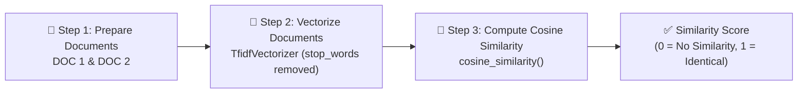
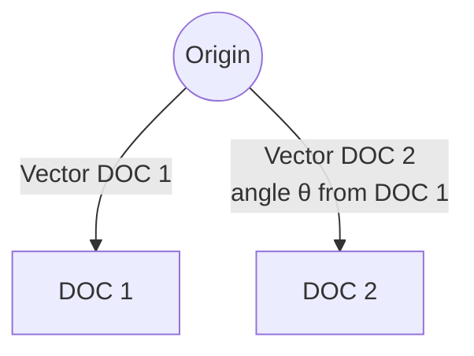

<div align="center">

### 🌐 Experiment 1 - Cosine Similarity (TF-IDF)

---

**Text Vectorization • TF-IDF Weighting • Cosine Similarity Scoring**

[](#) [](#) [](#) [](#) [](#)

</div>


# Aim

To compute the **Cosine Similarity** between two text documents by first converting them into numerical vectors using **TF-IDF (Term Frequency–Inverse Document Frequency) vectorization**, and to determine how similar the documents are in the vector space using `scikit-learn`.


# Description

## 🧭 Overview

Cosine similarity is a fundamental technique in **Information Retrieval Systems** used to measure how similar two documents are, irrespective of their length, by comparing the angle between their vector representations in a multi-dimensional term space. The smaller the angle between two document vectors, the higher their similarity.

The experiment follows a **three-step pipeline**: preparing the documents, converting them into TF-IDF vectors, and finally computing the cosine similarity between those vectors.



## 📝 Step 1 — Prepare the Documents

Two (or more) documents are taken as input. These can be topic descriptions, subject overviews, or actual text files.

| Document | Text |
|----------|------|
| **DOC 1** | Machine learning is a method of data analysis. |
| **DOC 2** | Data analysis can be done using machine learning techniques. |

## 🧮 Step 2 — Vectorize the Documents (TF-IDF)

The text is converted into numerical vectors using `TfidfVectorizer` from `scikit-learn`. Stop words (like "is", "a", "using") are removed before vectorization so that only meaningful terms contribute to the similarity score.

After removing stop words, the following terms and their TF-IDF weights were obtained for each document:

| Term | DOC 1 | DOC 2 |
|------|-------|-------|
| machine | 0.707 | 0.707 |
| learning | 0.707 | 0.707 |
| method | 0.707 | 0.000 |
| data | 0.707 | 0.707 |
| analysis | 0.707 | 0.707 |
| techniques | 0.000 | 0.707 |
| done | 0.000 | 0.707 |

Each document is now represented as a **vector in term space**, where the magnitude along each axis corresponds to a term's TF-IDF weight.

## 📐 Step 3 — Compute Cosine Similarity

Using `cosine_similarity()` from `sklearn.metrics.pairwise`, the angle **θ** between the two document vectors (DOC 1 and DOC 2) is used to compute their similarity:



The cosine similarity formula compares the two vectors as:

> Cosine Similarity = (DOC1 · DOC2) / (‖DOC1‖ × ‖DOC2‖) = cos(θ)

## 💡 Observation

The two documents were found to be **highly similar**, which makes sense since both discuss the topics of *machine learning* and *data analysis*.

## 🌍 Real-World Applications

| Application | Description |
|-------------|--------------|
| 🔍 **Search Engines** | Match a user's query with the most relevant documents/webpages. |
| 🧾 **Plagiarism Detection** | Compare text documents for content similarity. |
| 🎯 **Recommendation Systems** | Suggest articles or courses similar to what a user has already read. |
| 📧 **Email Classification** | Group similar emails (Work, Promotions, Personal) based on their content. |


# Output

The program computed the cosine similarity between **DOC 1** and **DOC 2** and printed the result to the console. The output (as captured on the laptop screen in the source image) was:

```text
Cosine Similarity: 0.8165
```

This confirms the observation that the two documents are highly similar, as their cosine similarity score (0.8165) is close to 1 (perfect similarity).

> ⚠️ **Note:** `0.8165` is the value transcribed exactly as shown on the laptop screen in the source photograph. Re-running the reconstructed `source_code.py` (using DOC 1 / DOC 2 text taken from the "Step 1" boxes) produces `0.5803` instead. [UNCLEAR: The exact cause of this mismatch cannot be determined from the photograph — the document wording used to generate the original 0.8165 result may differ slightly from what is shown in the Step 1 boxes.] Per the accuracy policy, the photographed output (0.8165) is preserved here rather than replaced with the freshly computed value.


