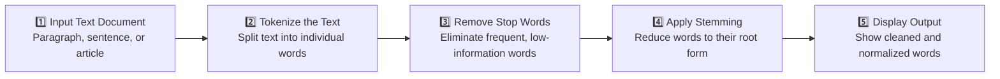

<div align="center">

### 📄 Experiment 2 - Pre-Processing of a Text Document: Stop Word Removal and Stemming

---

**Tokenization • Stop Word Removal • Stemming • Text Normalization**

[](#) [](#) [](#) [](#) [](#)

</div>


# Aim

To perform text preprocessing by removing stop words and applying stemming to normalize and clean a text document for better analysis in NLP and IR applications.


# Description

## 💡 Problem Statement

Raw text contains many common words (e.g., *"is"*, *"the"*, *"in"*) that don't add much meaning. Additionally, different forms of a word (e.g., *"connect"*, *"connected"*, *"connecting"*) refer to the same underlying meaning. This experiment uses **stop word removal** and **stemming** to clean and normalize text for better downstream processing.

## 🔄 Process Pipeline

The experiment follows five sequential steps to transform raw text into a cleaned, normalized token list:



| Step | Description |
|------|-------------|
| **1. Input Text Document** | A paragraph, sentence, or article is taken as raw input. |
| **2. Tokenize the Text** | The text is split into individual words using `word_tokenize()`. |
| **3. Remove Stop Words** | Frequent, low-information words (e.g., "is", "in", "and") are eliminated using NLTK's English stop-word list. |
| **4. Apply Stemming** | Remaining words are reduced to their root form using the **Porter Stemmer** algorithm. |
| **5. Display Output** | The original text, the stop-word-filtered tokens, and the stemmed tokens are printed. |

## 🌍 Real-World Use Cases

| Application | Benefit |
|-------------|---------|
| 🔍 **Search Engines** | Improves matching by reducing noisy and variable terms. |
| 🧾 **Plagiarism Detection** | Helps detect similar content despite different wording. |
| 🤖 **Chatbots** | Makes it easier to match user intent with fewer keywords. |
| 🗂️ **Document Classification** | Reduces vocabulary size, improving accuracy and efficiency. |

## 🎯 Outcome of the Experiment

- ✅ Understand the need for preprocessing in NLP and IR.
- ✅ Implement basic preprocessing techniques: stop word removal and stemming.
- ✅ Apply these techniques to clean and normalize any textual input.


# Output

## Original Text

```text
Machine learning algorithms are widely used in data analysis and data science tasks.
```

*This is the raw input text, containing all words, including stop words and various word forms.*

## After Stop Word Removal

```text
['Machine', 'learning', 'algorithms', 'widely', 'used', 'data', 'analysis',
 'data', 'science', 'tasks']
```

*Words like "are", "in", and "and" were removed because they are stop words and do not add meaningful information.*

## After Stemming

```text
['machin', 'learn', 'algorithm', 'wide', 'use', 'data', 'analysi',
 'data', 'scienc', 'task']
```

*Words are reduced to their root (base) form — e.g., "learning" → "learn", "analysis" → "analysi".*


