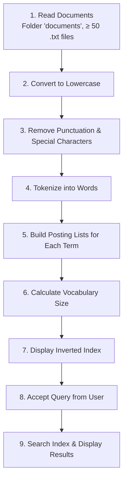

<div align="center">

### 🗂️ Experiment 3 - Construction of an Inverted Index for a Document Collection

---

**Tokenization • Vocabulary Construction • Posting Lists • Query Retrieval**

[](#) [](#) [](#) [](#) [](#)

</div>


# Aim

To construct an **Inverted Index** for a given document collection comprising of at least 50 documents with a total vocabulary size of at least 1000 unique words, and to support efficient retrieval of documents containing a given query term.


# Description

## 🎯 Objectives

1. Understand the concept of an inverted index in Information Retrieval.
2. Preprocess a collection of text documents.
3. Extract and normalize terms from documents.
4. Construct a dictionary of terms and their corresponding posting lists.
5. Calculate the vocabulary size of the document collection.
6. Retrieve documents efficiently using the constructed inverted index.

## 🧰 Software Requirements

- Python 3.x
- Jupyter Notebook / Google Colab / VS Code
- Python libraries: `os`, `re`, `collections`

## 📖 Theory

An **Inverted Index** is a data structure used in Information Retrieval systems to map each term to the list of documents in which that term occurs. Instead of searching every document whenever a query is submitted, the search system directly accesses the posting list associated with the query term.

**Example.** Consider three documents:

| Document | Content |
|----------|---------|
| **D1** | information retrieval systems |
| **D2** | information retrieval techniques |
| **D3** | database systems |

The inverted index built from this collection would be:

| Term | Posting List |
|------|--------------|
| information | D1, D2 |
| retrieval | D1, D2 |
| systems | D1, D3 |
| techniques | D2 |
| database | D3 |

### Basic Structure

```
Term         →   Posting List
information  →   [D1, D2]
retrieval    →   [D1, D2]
systems      →   [D1, D3]
database     →   [D3]
```

The collection of all unique terms is called the **Vocabulary**.

## 🧮 Algorithm

| Step | Description |
|------|-------------|
| **1** | Read the document collection containing at least 50 documents. |
| **2** | Convert all text to lowercase. |
| **3** | Remove punctuation, special characters, and unnecessary symbols. |
| **4** | Tokenize each document into individual words. |
| **5** | For every unique word, maintain a posting list containing the document IDs in which the word occurs. |
| **6** | Calculate the vocabulary size. |
| **7** | Display the inverted index. |
| **8** | Accept a query term from the user. |
| **9** | Search the inverted index and display the documents containing the query term. |

## 🔍 Step-by-Step Walkthrough (with Example)



The following walkthrough illustrates the pipeline using the first 3 example documents:

**Step 1 — Read the Document Collection.** A collection of at least 50 text documents is read from a folder named `documents`. Example (first 3 shown):

| File | Content |
|------|---------|
| `doc01.txt` | Information retrieval is the process of obtaining relevant information from a large collection of documents. |
| `doc02.txt` | Inverted index is a key data structure used in information retrieval systems for fast search operations. |
| `doc03.txt` | Search engines use inverted index to retrieve documents efficiently based on user queries. |

**Step 2 — Convert All Text to Lowercase.** All characters in each document are converted to lowercase (e.g., "Information retrieval is the process..." → "information retrieval is the process...").

**Step 3 — Remove Punctuation, Special Characters, and Unnecessary Symbols.** Punctuation, special characters, and symbols are removed and replaced with spaces (e.g., the trailing period in each sentence is stripped).

**Step 4 — Tokenize Each Document into Individual Words.** The cleaned text is split into individual tokens, e.g.:

- `doc01.txt` → `['information', 'retrieval', 'is', 'the', 'process', 'of', 'obtaining', 'relevant', 'information', 'from', 'a', 'large', 'collection', 'of', 'documents']`
- `doc02.txt` → `['inverted', 'index', 'is', 'a', 'key', 'data', 'structure', 'used', 'in', 'information', 'retrieval', 'systems', 'for', 'fast', 'search', 'operations']`
- `doc03.txt` → `['search', 'engines', 'use', 'inverted', 'index', 'to', 'retrieve', 'documents', 'efficiently', 'based', 'on', 'user', 'queries']`

**Step 5 — For Every Unique Word, Maintain a Posting List.** We scan each document and, for every unique word, store the document ID in its posting list. Partial inverted index after processing the first 3 documents:

| Term | Posting List | Term | Posting List |
|------|---------------|------|---------------|
| information | doc01.txt, doc02.txt | inverted | doc02.txt, doc03.txt |
| retrieval | doc01.txt, doc02.txt | index | doc02.txt, doc03.txt |
| process | doc01.txt | search | doc02.txt, doc03.txt |
| obtaining | doc01.txt | engines | doc03.txt |
| relevant | doc01.txt | queries | doc03.txt |

> **Note:** As more documents are processed, posting lists are updated by adding the document ID wherever the term occurs.

**Step 6 — Calculate the Vocabulary Size.** The vocabulary size is the number of unique terms in the entire collection.

**Step 7 — Display the Inverted Index.** The complete inverted index is displayed as a mapping from each term to its posting list. The index may contain thousands of terms, each with its own posting list.

**Step 8 — Accept a Query Term from the User.** The user enters a search term that needs to be retrieved.

**Step 9 — Search the Inverted Index and Display Results.** The system searches the inverted index for the query term and returns the list of documents containing it.


## 🗃️ Document Collection Structure

A folder named `documents` must be placed in the same directory as the Python program. This experiment uses the actual **50-document collection** provided (`IRS_Experiment_3_50_Documents_1000plus_Vocabulary.zip`), which satisfies the requirement of at least 50 documents and at least 1000 unique vocabulary terms:

```
Experiment-03-Inverted-Index/
├── Description.md
├── source_code.py
└── documents/
    ├── doc01.txt
    ├── doc02.txt
    ├── doc03.txt
    ├── ...
    ├── doc49.txt
    └── doc50.txt
```

- The folder contains **50 `.txt` documents** (`doc01.txt` – `doc50.txt`).
- The complete collection contains **1,569 unique vocabulary terms**, exceeding the 1,000-term requirement.

## 📌 Key Definitions

- **Vocabulary size** = number of unique terms.
- **Posting list** = documents containing a particular term.
- **Document Frequency (DF)** = number of documents containing the term.

> Example: `retrieval → [D01, D03, D08]` ⇒ `DF(retrieval) = 3`

## ✅ Result

The inverted index was successfully constructed for the given document collection. The system successfully generated the vocabulary and posting lists and retrieved the documents corresponding to a given query term.

## 📝 Conclusion

Thus, an **Inverted Index** was implemented successfully for a document collection containing at least 50 documents and a vocabulary of at least 1000 unique words. The constructed index enables efficient term-based document retrieval without scanning the entire document collection.


# Output

> The results below were obtained by **actually running `source_code.py`** against the real 50-document collection provided (`documents/doc01.txt` – `doc50.txt`), not the illustrative/sample values from the poster.

## Actual Input (Document Collection Statistics)

| Metric | Value |
|--------|-------|
| Number of Documents | 50 |
| Vocabulary Size | 1,569 |
| Number of Terms | 1,569 |

## Actual Program Output (Inverted Index Construction Header)

```text
============================================================
     INVERTED INDEX CONSTRUCTION
============================================================
Number of Documents : 50
Vocabulary Size      : 1569
Number of Terms       : 1569
============================================================
```

## Actual Inverted Index (Sample Entries)

A representative sample of entries from the actual generated index — some terms are common across nearly all documents, while others (technical/compound terms) are specific to a smaller subset:

```text
INVERTED INDEX
------------------------------------------------------------
algorithm            -> ['doc01.txt', 'doc02.txt', ... 'doc50.txt']   (all 50 docs)
data                 -> ['doc01.txt', 'doc02.txt', ... 'doc50.txt']   (all 50 docs)
document             -> ['doc01.txt', 'doc02.txt', ... 'doc50.txt']   (all 50 docs)
information          -> ['doc01.txt', 'doc02.txt', ... 'doc50.txt']   (all 50 docs)
retrieval            -> ['doc01.txt', 'doc02.txt', ... 'doc50.txt']   (all 50 docs)
search               -> ['doc01.txt', 'doc02.txt', ... 'doc50.txt']   (all 50 docs)
vocabulary           -> ['doc01.txt', 'doc02.txt', ... 'doc50.txt']   (all 50 docs)
database             -> ['doc03.txt', 'doc04.txt', 'doc07.txt', 'doc13.txt', 'doc14.txt', 'doc17.txt', 'doc23.txt', 'doc24.txt', 'doc27.txt', 'doc33.txt', 'doc34.txt', 'doc37.txt', 'doc43.txt', 'doc44.txt']
wildcard             -> ['doc07.txt', 'doc14.txt', 'doc17.txt', 'doc24.txt', 'doc34.txt', 'doc41.txt', 'doc44.txt']
vulnerability        -> ['doc06.txt', 'doc13.txt', 'doc16.txt', 'doc23.txt', 'doc33.txt', 'doc40.txt', 'doc43.txt', 'doc50.txt']
web                  -> ['doc02.txt', 'doc05.txt', 'doc06.txt', 'doc12.txt', 'doc15.txt', 'doc16.txt', 'doc19.txt', 'doc22.txt', 'doc25.txt', 'doc26.txt', 'doc29.txt', 'doc35.txt', 'doc36.txt', 'doc39.txt', 'doc45.txt', 'doc46.txt', 'doc49.txt']
word2vec             -> ['doc03.txt', 'doc13.txt', 'doc20.txt', 'doc23.txt', 'doc30.txt', 'doc33.txt', 'doc40.txt', 'doc50.txt']
xgboost              -> ['doc03.txt', 'doc10.txt', 'doc13.txt', 'doc20.txt', 'doc30.txt', 'doc37.txt', 'doc40.txt', 'doc47.txt']
zero                 -> ['doc09.txt', 'doc16.txt', 'doc19.txt', 'doc26.txt', 'doc36.txt', 'doc43.txt', 'doc46.txt']
```

*(Full posting lists were truncated with `...` above only for readability in this document; the actual program prints every document ID in each list.)*

## Actual Query Processing

**Query 1 — "database" (moderately common term)**

```text
Enter search term (or 'exit'): database

Term : database
Documents containing the term:
['doc03.txt', 'doc04.txt', 'doc07.txt', 'doc13.txt', 'doc14.txt', 'doc17.txt', 'doc23.txt', 'doc24.txt', 'doc27.txt', 'doc33.txt', 'doc34.txt', 'doc37.txt', 'doc43.txt', 'doc44.txt']
Docmnt Frequency : 14
```

**Query 2 — "wildcard" (less common term)**

```text
Enter search term (or 'exit'): wildcard

Term : wildcard
Documents containing the term:
['doc07.txt', 'doc14.txt', 'doc17.txt', 'doc24.txt', 'doc34.txt', 'doc41.txt', 'doc44.txt']
Docmnt Frequency : 7
```

**Query 3 — "blockchain" (term not in the collection)**

```text
Enter search term (or 'exit'): blockchain

Term not found in the collection.
```

> **Note:** The `"Docmnt Frequency :"` label is printed exactly as it appears in the source code (see the note in `source_code.py`), reproducing the original poster's spelling as-is.


