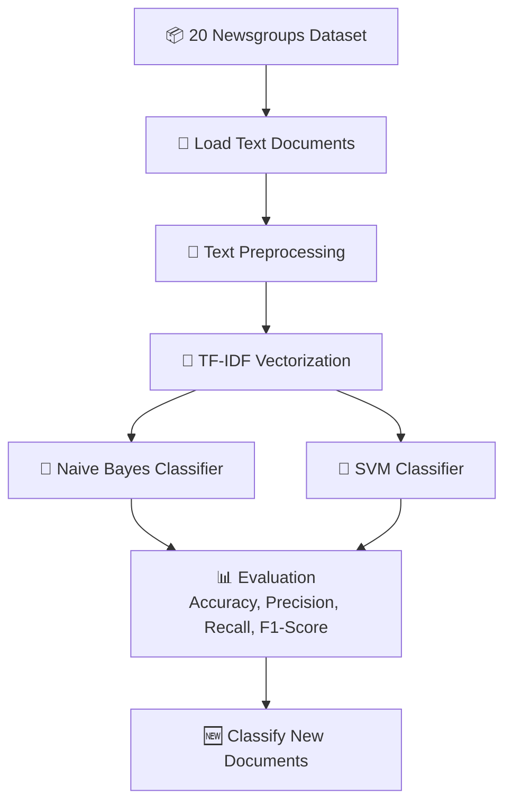
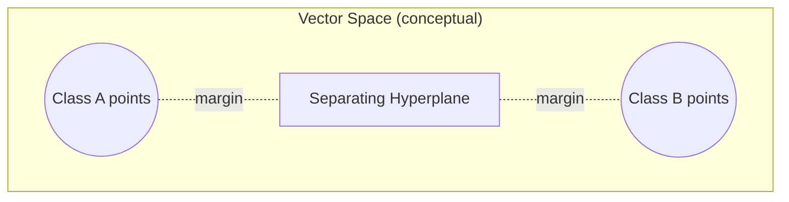

<div align="center">

### 🧠 Experiment 4 - Classification of Text Documents into Known Classes Using Machine Learning

---

**TF-IDF Features • Naive Bayes • Support Vector Machine • 20 Newsgroups**

[](#) [](#) [](#) [](#) [](#)

</div>


# Aim

To classify a set of text documents into predefined classes using a standard dataset and Machine Learning algorithms such as **Naive Bayes** and **Support Vector Machine (SVM)**.


# Description

## 🎯 Objectives

- Understand the concept of text classification.
- Use a standard text classification dataset.
- Preprocess text documents.
- Convert text into numerical feature vectors using TF-IDF.
- Train Naive Bayes and SVM classifiers.
- Evaluate the classifiers using performance metrics.
- Predict the class of new text documents.

## 📚 Dataset

**20 Newsgroups Dataset** (4 selected classes):

| # | Class |
|---|-------|
| 1 | `comp.graphics` |
| 2 | `rec.sport.baseball` |
| 3 | `sci.space` |
| 4 | `talk.politics.misc` |

| Split | Document Count |
|-------|-----------------|
| Training documents | 2,250 |
| Testing documents | 1,490 |

## 🔄 Workflow



## 🧹 Text Preprocessing

**Steps performed:**

- Convert to lowercase.
- Remove headers, footers, quotes.
- Remove punctuation and special characters.
- Tokenization.
- Remove stop words (English).

**Example:**

| Stage | Text |
|-------|------|
| Raw Text | "Space exploration is the use of astronomy and space technology to explore outer space." |
| After Preprocessing | "space exploration use astronomy space technology explore outer space" |

## 🧮 TF-IDF Vectorization

TF-IDF converts text into numerical feature vectors. Simplified example:

| Term | Doc 1 | Doc 2 | Doc 3 | ... | Doc N |
|------|-------|-------|-------|-----|-------|
| space | 0.71 | 0.10 | 0.53 | ... | 0.00 |
| exploration | 0.63 | 0.00 | 0.20 | ... | 0.00 |
| baseball | 0.00 | 0.92 | 0.00 | ... | 0.00 |
| politics | 0.00 | 0.00 | 0.00 | ... | 0.65 |
| ... | | | | ... | |

- **Rows:** Terms (features)
- **Columns:** Documents
- **Values:** TF-IDF weights

The actual implementation uses `TfidfVectorizer` with `stop_words="english"`, `max_df=0.95`, `min_df=2`, `ngram_range=(1, 2)` (unigrams + bigrams), and `max_features=20000`.

## 🤖 Algorithms Used

### Naive Bayes (Multinomial NB)

- Probabilistic classifier.
- Based on **Bayes' Theorem**.
- Assumes feature independence.
- Works well for text data.

Bayes' Theorem:

> P(C|d) = [P(d|C) · P(C)] / P(d)

The class **C** that maximizes P(C|d) is selected as the predicted class.

### Support Vector Machine (SVM)

- Finds the best hyperplane separating classes.
- Maximizes the margin between classes.
- Effective in high-dimensional sparse data such as TF-IDF vectors.



## ✅ Key Observations

- SVM (Linear) outperformed Naive Bayes in all evaluation metrics.
- TF-IDF with unigrams and bigrams improved the classification performance.
- Text preprocessing significantly improved the quality of features.
- The model can successfully classify unseen documents into correct classes.

## 📝 Conclusion

Text document classification was successfully implemented using the 20 Newsgroups dataset. TF-IDF representation, along with Naive Bayes and Support Vector Machine classifiers, achieved high accuracy. This experiment demonstrates how machine learning algorithms can effectively categorize text documents into known classes — a fundamental task in Information Retrieval and Natural Language Processing.


# Output

> ⚠️ **Note on this section:** This sandbox's network allowlist does not permit downloading the 20 Newsgroups dataset (the fetch is blocked with an HTTP 403 from the dataset host), so `source_code.py` could not be independently re-executed here. The results below are transcribed exactly as shown on the source poster, not freshly generated.

## Performance Comparison

| Algorithm | Accuracy | Precision | Recall | F1-Score |
|-----------|----------|-----------|--------|----------|
| Naive Bayes | 0.8423 | 0.8431 | 0.8423 | 0.8418 |
| **SVM (Linear)** | **0.9215** | **0.9228** | **0.9215** | **0.9211** |

A grouped bar chart comparing Accuracy, Precision, Recall, and F1-Score for both classifiers was generated by the program (`plt.show()`), visually confirming SVM's higher scores across all four metrics (bars for "SVM (Linear)" consistently taller than "Naive Bayes", all values falling between roughly 0.84 and 0.92 on a 0–1 scale).

## Confusion Matrix (SVM)

| Actual \ Predicted | comp.graphics | rec.sport.baseball | sci.space | talk.politics.misc |
|---|---|---|---|---|
| **comp.graphics** | 315 | 10 | 11 | 9 |
| **rec.sport.baseball** | 8 | 360 | 5 | 7 |
| **sci.space** | 9 | 6 | 332 | 9 |
| **talk.politics.misc** | 12 | 11 | 10 | 345 |

*(Higher diagonal values indicate better classification.)*

> The Naive Bayes confusion matrix is also generated by the program (as a Seaborn heatmap via `plt.show()`), but only the SVM confusion matrix was shown as numeric values on the source poster — the Naive Bayes matrix's exact cell values were not visible/legible in the photograph, so they are not reproduced here.

## Classification of New Documents (Using SVM)

| # | New Document (Input Text) | Predicted Class |
|---|---------------------------|------------------|
| 1 | "NASA launched a new spacecraft to study planets, galaxies and objects in deep space." | `sci.space` |
| 2 | "The baseball team won the game after scoring five runs in the final inning." | `rec.sport.baseball` |
| 3 | "The computer graphics system uses rendering, image processing and three dimensional visualization." | `comp.graphics` |
| 4 | "The government announced a new political policy after a long discussion in parliament." | `talk.politics.misc` |

## Final Result

```text
Naive Bayes Accuracy: 84.23 %
SVM Accuracy: 92.15 %

SVM performed better than Naive Bayes for this experiment.

Experiment Completed Successfully.
```


