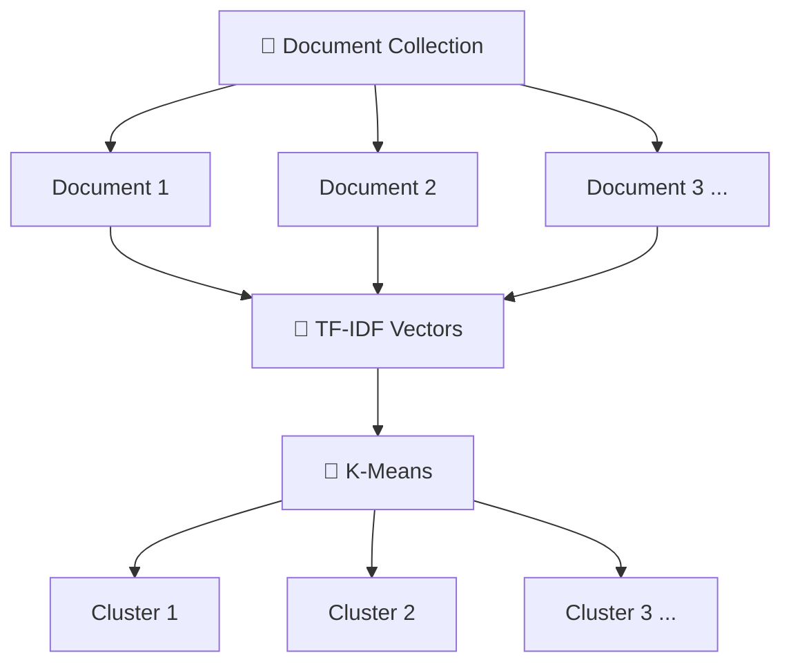
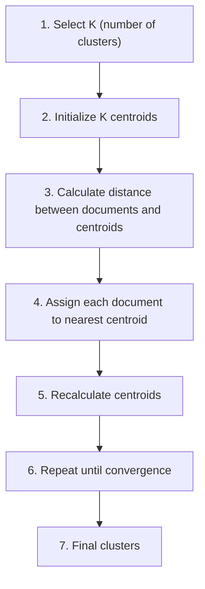
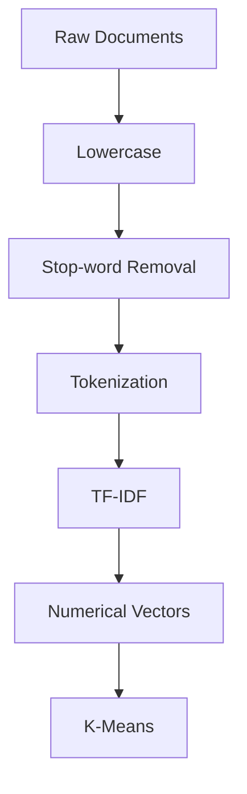
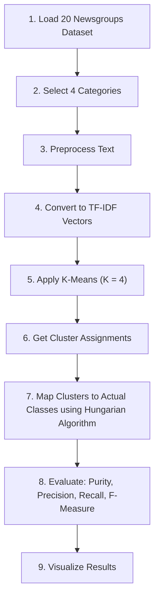

<div align="center">

### 🧩 Experiment 5 - Text Document Clustering Using K-Means

---

**Unsupervised Learning • TF-IDF • K-Means • Purity, Precision, Recall, F-Measure**

[](#) [](#) [](#) [](#) [](#)

</div>


# Aim

To perform text document clustering using the **K-Means clustering algorithm** on a standard text dataset, and to evaluate the clustering performance using **Purity, Precision, Recall, and F-measure**.


# Description

## 🎯 Objectives

1. Understand the concept of unsupervised text document clustering.
2. Use a standard text dataset for clustering.
3. Preprocess text documents.
4. Convert text documents into numerical vectors using TF-IDF.
5. Apply the K-Means clustering algorithm.
6. Compare the generated clusters with the known class labels.
7. Calculate Purity, Precision, Recall, and F-measure.
8. Visualize the clustering results.

## 📚 Dataset

**20 Newsgroups Dataset** (4 categories):

| Class No. | Newsgroup | Description |
|-----------|-----------|-------------|
| 0 | `comp.graphics` | Computer Graphics |
| 1 | `rec.sport.baseball` | Baseball |
| 2 | `sci.space` | Space Science |
| 3 | `talk.politics.misc` | Politics |

> **Note:** K-Means does **not** use class labels during clustering. Labels are used only for evaluation.

## 📖 Theory — What is Document Clustering?

Document clustering is the process of automatically grouping similar documents into clusters. It is an **unsupervised learning technique** — no class labels are used to guide the grouping.



## 🔁 K-Means Algorithm — Basic Process



**Objective:** Minimize the within-cluster sum of squared distances:

> J = Σₖ₌₁ᴷ Σ_{x ∈ Cᵢ} ‖x − μᵢ‖²

where:
- **K** = number of clusters
- **Cᵢ** = cluster *i*
- **x** = document vector
- **μᵢ** = centroid of cluster *i*

## 🧮 Text Representation Using TF-IDF

**Processing pipeline:**



**Example:**

- Document: *"NASA launched a new spacecraft into space"*
- TF-IDF Vector: `[0.00, 0.41, 0.73, 0.00, 0.18, ...]`

**Why TF-IDF?** TF-IDF gives higher importance to terms that are important within a document but less common across the collection.

> TF-IDF(t, d) = TF(t, d) × IDF(t)
>
> IDF(t) = log(N / df(t))

where **t** = term, **d** = document, **N** = total number of documents, **df(t)** = number of documents containing term *t*.

## 🔗 Evaluation — Cluster IDs vs Actual Classes

K-Means produces cluster IDs (`Cluster 0`, `Cluster 1`, `Cluster 2`, `Cluster 3`) that do **not** correspond directly to actual classes (`comp.graphics`, `rec.sport.baseball`, `sci.space`, `talk.politics.misc`).

**Example mapping (possible output):**

| Cluster | Mostly Maps To |
|---------|-----------------|
| Cluster 0 | `sci.space` |
| Cluster 1 | `comp.graphics` |
| Cluster 2 | `talk.politics.misc` |
| Cluster 3 | `rec.sport.baseball` |

> **Important:** Before calculating Precision, Recall, and F-measure, the generated clusters are mapped to actual classes using the **Hungarian algorithm**, which finds the best one-to-one mapping that maximizes agreement.

## 📏 Performance Measures

| Measure | Formula | Meaning |
|---------|---------|---------|
| **Purity** | Purity = (1/N) Σₖ maxⱼ \|Cₖ ∩ Lⱼ\| | How pure each cluster is with respect to the actual classes. Higher → better. |
| **Precision** | Precision = TP / (TP + FP) | Accuracy of documents assigned to a class. Higher → better. |
| **Recall** | Recall = TP / (TP + FN) | How many documents of a class were successfully retrieved. Higher → better. |
| **F-Measure** | F₁ = (2 × P × R) / (P + R) | Combines Precision and Recall. Higher → better. |

where **Cₖ** = generated cluster, **Lⱼ** = actual class, **N** = total number of documents, **TP/FP/FN** = true positives / false positives / false negatives.

## 🔄 Experiment Workflow



## 🧾 Illustrative Contingency Matrix (Worked Example)

A small worked example of a Cluster-vs-Actual-Class contingency matrix, shown to illustrate the evaluation concept before mapping:

| Actual Class | C0 | C1 | C2 | C3 | Row Total |
|--------------|----|----|----|----|-----------|
| comp.graphics | 20 | 110 | 15 | 10 | 155 |
| rec.sport.baseball | 5 | 15 | 130 | 10 | 160 |
| sci.space | 115 | 10 | 20 | 5 | 150 |
| talk.politics.misc | 10 | 20 | 15 | 140 | 185 |
| **Column Total** | **150** | **155** | **180** | **165** | **650** |

> After mapping clusters to actual classes, Purity, Precision, Recall, and F-measure are computed from a matrix of this form.


# Output

> ⚠️ **Note on this section:** As with Experiment 4, this sandbox's network allowlist blocks downloading the 20 Newsgroups dataset (`fetch_20newsgroups` returns an HTTP 403 from the dataset host), so `source_code.py` could not be independently re-executed here. The results below are transcribed exactly as shown in the poster's "Sample Output (Example)" panel — the poster itself notes: *"Exact results may vary slightly on each execution depending on initialization and processing."*

## A. Dataset Information

```text
Number of documents: 11314
Number of classes: 4
Classes: ['comp.graphics', 'rec.sport.baseball', 'sci.space', 'talk.politics.misc']
```

## B. Contingency Matrix (Actual vs Cluster)

| Actual ↓ / Cluster → | 0 | 1 | 2 | 3 |
|---|---|---|---|---|
| comp.graphics | 130 | 1115 | 140 | 557 |
| rec.sport.baseball | 120 | 160 | 1335 | 455 |
| sci.space | 1470 | 110 | 160 | 460 |
| talk.politics.misc | 550 | 1400 | 280 | 175 |

## C. Best Cluster to Class Mapping

```text
Cluster 0 -> sci.space
Cluster 1 -> comp.graphics
Cluster 2 -> rec.sport.baseball
Cluster 3 -> talk.politics.misc
```

## D. Performance Measures (Example)

```text
Purity     : 0.7321
Precision  : 0.7284
Recall     : 0.7284
F-Measure  : 0.7280
ARI        : 0.5652
NMI        : 0.6427
```

## E. Classification Report After Mapping (Example)

```text
                     precision  recall  f1-score  support
comp.graphics             0.60    0.64      0.62     1942
rec.sport.baseball        0.65    0.63      0.64     2070
sci.space                 0.69    0.72      0.71     2200
talk.politics.misc        0.67    0.65      0.66     2016

accuracy                                    0.66     8228
macro avg                 0.65    0.66      0.66     8228
weighted avg              0.66    0.66      0.66     8228
```

## F. Confusion Matrix After Mapping

| Actual ↓ / Predicted → | comp.graphics | rec.sport.baseball | sci.space | talk.politics.misc |
|---|---|---|---|---|
| comp.graphics | 1250 | 220 | 150 | 322 |
| rec.sport.baseball | 240 | 1320 | 180 | 330 |
| sci.space | 180 | 170 | 1580 | 270 |
| talk.politics.misc | 280 | 310 | 280 | 1266 |

## G. Visualizations

- **Performance Bar Chart:** Bars for Purity (0.7321), Precision (0.7284), Recall (0.7284), and F-Measure (0.7280), all in a similar 0.72–0.73 range.
- **PCA Clustering Plot:** A 2D scatter plot (via PCA dimensionality reduction to 2 components) showing four visually separated colored clusters, indicating that K-Means found reasonably distinct groupings in the TF-IDF vector space.


