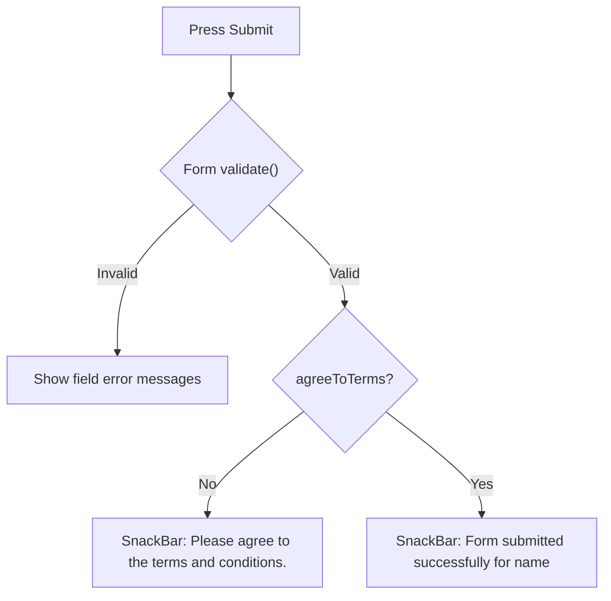

<div align="center">

# 📝 Experiment 7(a) - Form with Various Input Fields

### TextFormField &nbsp;•&nbsp; Dropdown &nbsp;•&nbsp; Radio &nbsp;•&nbsp; Checkbox &nbsp;•&nbsp; Switch

</div>

[](https://raw.githubusercontent.com/andreasbm/readme/master/assets/lines/rainbow.gif)

# 🎯 Aim

To design and implement a Flutter form containing various input fields such as TextField, TextFormField, DropdownButtonFormField, Radio buttons, Checkbox, and Switch.

[](https://raw.githubusercontent.com/andreasbm/readme/master/assets/lines/rainbow.gif)

# 📝 Description

Flutter provides form widgets for collecting and validating user input. The `Form` widget groups multiple input fields into a single form, and form fields can be arranged using `Column`, `Padding`, and other layout widgets. This demonstrates how different Flutter input controls can be combined into a single form.

## 1️⃣ Input Widgets

| # | Widget | Purpose |
|---|--------|---------|
| 1️⃣ | `Form` | Groups and manages form fields |
| 2️⃣ | `TextFormField` | Accepts text-based input and supports validation |
| 3️⃣ | `DropdownButtonFormField` | Lets the user select an option from a list |
| 4️⃣ | `RadioListTile` | Lets the user select one option from multiple choices |
| 5️⃣ | `CheckboxListTile` | Option that can be selected or deselected |
| 6️⃣ | `SwitchListTile` | Simple on/off control |
| 7️⃣ | `ElevatedButton` | Submits the form |
| 8️⃣ | `GlobalKey<FormState>` | Identifies, accesses and validates the form |
| 9️⃣ | `TextEditingController` | Accesses and manages the text entered in a field |
| 🔟 | `InputDecoration` | Provides labels, hints, icons, and borders for input fields |

> ℹ️ The Aim lists `TextField`, but the program uses only `TextFormField`. Radio buttons, the checkbox and the switch are the `ListTile` variants (`RadioListTile`, `CheckboxListTile`, `SwitchListTile`).

## 2️⃣ Program Structure

In this program, the user enters a name and email, selects a course and gender, and chooses additional preferences. `RegistrationForm` is a `StatefulWidget` whose state holds the controllers, the selected values and a `GlobalKey<FormState>`.

| Field | Widget | Details |
|-------|--------|---------|
| Name | `TextFormField` | Person icon; validator: *Please enter your name* if empty |
| Email | `TextFormField` | Email keyboard, email icon; validators: *Please enter your email* if empty, *Enter a valid email address* if no `@` |
| Course | `DropdownButtonFormField<String>` | School icon; items *Flutter*, *Dart*, *Android*; validator: *Please select a course* if none selected |
| Gender | Two `RadioListTile<String>` | *Male* and *Female*; `gender` starts as `'Male'` |
| Terms | `CheckboxListTile` | *I agree to the terms and conditions*; `agreeToTerms` starts as `false` |
| Notifications | `SwitchListTile` | *Receive notifications*; `receiveNotifications` starts as `false` |
| Submit | `ElevatedButton` | Full width; calls `submitForm()` |

### ✅ Submit Logic

1. `_formKey.currentState!.validate()` checks the Name, Email and Course validators.
2. If the form is valid but `agreeToTerms` is `false`, a `SnackBar` shows *Please agree to the terms and conditions.*
3. Otherwise, a `SnackBar` shows *Form submitted successfully for* followed by the entered name.



> ℹ️ The email validator only checks that the text contains `@`. The `Radio`, `Checkbox` and `Switch` controls update the state with `setState()`.

> 💻 **Full source code:** [`source_code.dart`](./source_code.dart)

## ✅ Result

A Flutter form containing various input fields and basic validation was successfully designed and implemented.

[](https://raw.githubusercontent.com/andreasbm/readme/master/assets/lines/rainbow.gif)

# 📤 Output

> ⚠️ **Note:** No `output.xxxx` file was supplied. The description below is the expected output provided with the experiment, not a captured screenshot. Add screenshots of the form, the validation errors and the SnackBars here once available.
>
> In the supplied sketch both gender options appear unselected, but in the code `gender` starts as `'Male'`, so *Male* would be selected when the app first opens.

The application displays a Student Registration Form containing:

```text
Student Registration

[ Name                    ]
[ Email                   ]
[ Course ▼                ]

Gender
○ Male
○ Female

☐ I agree to the terms and conditions

Receive notifications       OFF

[          Submit          ]
```

When the **Submit** button is pressed, the required fields are validated. If the form is valid and the terms are accepted, a success message is displayed.

<!--  -->

[](https://raw.githubusercontent.com/andreasbm/readme/master/assets/lines/rainbow.gif)
