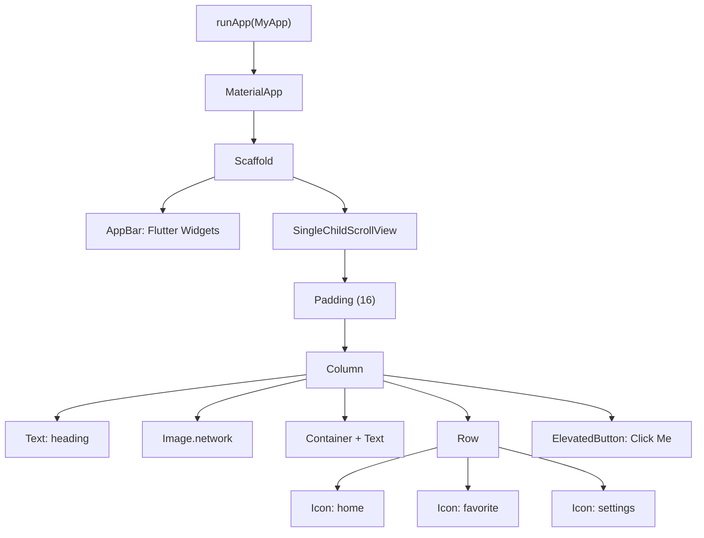

# 🧩 Experiment 2(a) - Explore Various Flutter Widgets

### Text &nbsp;•&nbsp; Image &nbsp;•&nbsp; Container &nbsp;•&nbsp; Row &nbsp;•&nbsp; Column &nbsp;•&nbsp; Icon &nbsp;•&nbsp; ElevatedButton

# 🎯 Aim

To explore and implement commonly used Flutter widgets such as Text, Image, Container, Row, Column, Icon, and ElevatedButton in a Flutter application.

# 📝 Description

Flutter provides a rich collection of **widgets** for building user interfaces. A widget represents a component of the application's user interface. Flutter widgets can be combined to create complex user interfaces, and most widgets are configured through properties passed to their constructors.

This experiment demonstrates the basic structure and usage of different Flutter widgets.

## 1️⃣ Widgets Explored

| # | Widget | Purpose |
|---|--------|---------|
| 1️⃣ | `Text` | Displays text on the screen |
| 2️⃣ | `Image` | Displays an image from assets or network sources |
| 3️⃣ | `Container` | Contains and decorates other widgets (padding, margin, color, decoration) |
| 4️⃣ | `Column` | Arranges its children vertically |
| 5️⃣ | `Row` | Arranges its children horizontally |
| 6️⃣ | `Icon` | Displays commonly used Material icons |
| 7️⃣ | `ElevatedButton` | Creates a raised button for user interaction |
| 8️⃣ | `Padding` | Adds empty space around its child widget |
| 9️⃣ | `SizedBox` | Provides fixed spacing |
| 🔟 | `Scaffold` | Provides the basic screen structure |

> ℹ️ `Center` (positions its child at the center of the available space) is described in the theory but is not used in this program.

## 2️⃣ Program Structure

The program defines a `MyApp` stateless widget and launches it with `runApp()`. The `MaterialApp` hosts a `Scaffold` with an `AppBar` titled *Flutter Widgets*, and the body is wrapped in a `SingleChildScrollView` and a `Padding` of 16 logical pixels.

Inside a `Column`, the following widgets are arranged from top to bottom, separated by `SizedBox(height: 20)`:

| Order | Widget | Details in the program |
|-------|--------|------------------------|
| 1 | `Text` | `'Exploring Flutter Widgets'`, font size 24, bold |
| 2 | `Image.network` | `https://picsum.photos/300/150`, 300 × 150, `BoxFit.cover` |
| 3 | `Container` | Full width, padding 20, rounded corners (radius 12), `Colors.blue.shade100`, containing a centered `Text` (`'This is a Container widget.'`, font size 18) |
| 4 | `Row` | `MainAxisAlignment.spaceEvenly` with `Icons.home`, `Icons.favorite`, `Icons.settings` (size 40) |
| 5 | `ElevatedButton` | Label `'Click Me'`; `onPressed` prints `Button pressed` to the console |

> 💻 **Full source code:** [`source_code.dart`](./source_code.dart)

## 3️⃣ Notes

- The image is loaded from a network URL, so an internet connection is required for it to appear.
- Pressing the button only prints `Button pressed` to the console; it does not change anything on the screen.

# 📤 Output

> ⚠️ **Note:** No `output.xxxx` file was supplied. The description below is the expected output provided with the experiment, not a captured screenshot. Add the screenshot here once available.

The application displays a screen containing:

- A heading using the `Text` widget.
- An image using the `Image` widget.
- A styled rectangular area using `Container`.
- Home, favorite, and settings icons arranged using `Row`.
- A clickable `ElevatedButton`.

<!--  -->

