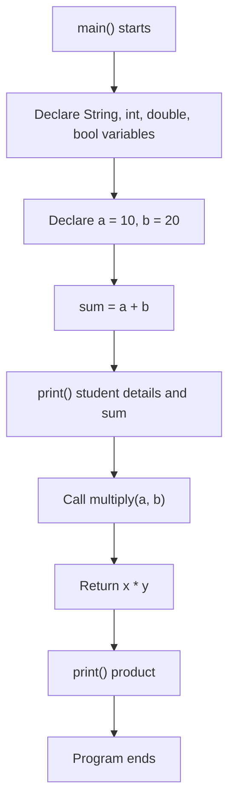

<div align="center">

# 💻 Experiment 1(b) - Simple Dart Program for Language Basics

</div>

[](https://raw.githubusercontent.com/andreasbm/readme/master/assets/lines/rainbow.gif)

# 🎯 Aim

To write and execute a simple Dart program to understand basic Dart language concepts such as variables, data types, operators, functions, and output statements.

[](https://raw.githubusercontent.com/andreasbm/readme/master/assets/lines/rainbow.gif)

# 📝 Description

**Dart** is a programming language developed by Google and is used for Flutter application development. A Dart program starts execution from the `main()` function.

## 1️⃣ Language Concepts Covered

| # | Concept | Explanation |
|---|---------|-------------|
| 1️⃣ | **Variables** | Declared using `var`, `int`, `double`, `String` and `bool` |
| 2️⃣ | **Typing** | Dart supports strong typing as well as type inference using `var` |
| 3️⃣ | **Output** | The `print()` function displays output on the console |
| 4️⃣ | **Operators** | Arithmetic operators such as `+`, `-`, `*` and `/` are used for calculations |
| 5️⃣ | **Strings** | Represented using single or double quotation marks |
| 6️⃣ | **String interpolation** | Values are embedded in strings using the `$` symbol |
| 7️⃣ | **Functions** | Declared using a return type, function name, parameters and a function body |
| 8️⃣ | **Boolean** | The `bool` type represents a true or false value |

## 2️⃣ Program Overview

The example program demonstrates how these concepts work together in a single application:

| Data Type | Variable | Value |
|-----------|----------|-------|
| `String` | `name` | `"Thrinath"` |
| `int` | `age` | `20` |
| `double` | `percentage` | `85.5` |
| `bool` | `isStudent` | `true` |
| `int` | `a`, `b` | `10`, `20` |

- Student information is declared using different data types.
- A simple arithmetic calculation (`sum = a + b`) is performed using integer variables.
- A separate function, `multiply(int x, int y)`, calculates the product of two numbers and returns an `int`.
- Values are displayed with `print()` using string interpolation (`$name`, `${multiply(a, b)}`).



> 💻 **Full source code:** [`source_code.dart`](./source_code.dart)

## 3️⃣ Execution

The program can be executed using the Dart SDK with the `dart` command:

```bash
dart run source_code.dart
```

## ✅ Result

The basic features of the Dart programming language, including variables, data types, operators, functions, and console output, were successfully demonstrated.

[](https://raw.githubusercontent.com/andreasbm/readme/master/assets/lines/rainbow.gif)

# 📤 Output

> ⚠️ **Note:** No `output.xxxx` file was supplied. The output below is the expected console output provided with the experiment. Replace it with a screenshot of the actual run if required.

```text
Dart Language Basics
--------------------
Name: Thrinath
Age: 20
Percentage: 85.5
Is Student: true
Sum of 10 and 20 = 30
Product of 10 and 20 = 200
```

[](https://raw.githubusercontent.com/andreasbm/readme/master/assets/lines/rainbow.gif)
