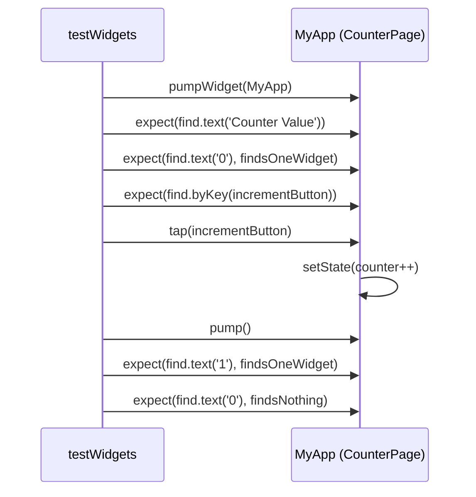

<div align="center">

# 🧪 Experiment 10(a) - Unit Tests for UI Components

### flutter_test &nbsp;•&nbsp; testWidgets() &nbsp;•&nbsp; WidgetTester

</div>

[](https://raw.githubusercontent.com/andreasbm/readme/master/assets/lines/rainbow.gif)

# 🎯 Aim

To write and execute unit/widget tests for Flutter UI components and verify that widgets display the expected content and respond correctly to user interactions.

[](https://raw.githubusercontent.com/andreasbm/readme/master/assets/lines/rainbow.gif)

# 📝 Description

**Testing** helps verify that a Flutter application's UI behaves as expected. Flutter provides the `flutter_test` package for writing widget and unit tests. A **widget test** checks the behavior and appearance of individual widgets or widget trees, and can help detect UI and interaction problems before an application is released.

## 1️⃣ Important Testing Methods

| Method | Purpose |
|--------|---------|
| `testWidgets()` | Defines a Flutter widget test |
| `WidgetTester` | Provides methods for interacting with widgets during testing |
| `pumpWidget()` | Loads a widget into the test environment |
| `find.text()` | Finds widgets containing specific text |
| `find.byType()` | Finds widgets based on their widget type |
| `find.byKey()` | Finds widgets using a `Key` |
| `tester.tap()` | Simulates a user tapping a widget |
| `tester.pump()` | Rebuilds the widget tree after an interaction |
| `expect()` | Verifies whether the actual result matches the expected result |

> ℹ️ `find.byType()` is described in the theory but is not used in this test. The test uses `find.text()` and `find.byKey()`.

## 2️⃣ Program Files

This experiment has two Dart files, both preserved from the original project paths:

| File here | Original path | Role |
|-----------|---------------|------|
| [`source_code1.dart`](./source_code1.dart) | `lib/main.dart` | The counter application being tested |
| [`source_code2.dart`](./source_code2.dart) | `test/widget_test.dart` | The widget test |

### 📱 Application under test (`source_code1.dart`)

A simple counter UI: `CounterPage` is a `StatefulWidget` with `int counter = 0` and `incrementCounter()` (calls `setState()`). The screen shows an `AppBar` titled *UI Component Test*, the text *Counter Value*, the counter `Text` (key `counterText`, font size 40, bold) and an `ElevatedButton` labelled *Increment* (key `incrementButton`).

### ✅ Test (`source_code2.dart`)

The single test, *Counter starts at zero and increments when button is tapped*, does the following:

1. `pumpWidget(const MyApp())` builds the application.
2. Verifies that the text *Counter Value* is found once.
3. Verifies that the text `0` is found once (initial value).
4. Verifies that the widget with key `incrementButton` exists.
5. Taps the *Increment* button with `tester.tap()`.
6. Calls `tester.pump()` to rebuild the widget tree.
7. Verifies that the text `1` is found once and the text `0` is no longer found.



> ℹ️ The test imports `package:flutter_lab/main.dart`, so the project's package name in `pubspec.yaml` must be `flutter_lab`, and the test file goes in the project's `test/` folder.

## 3️⃣ Running the Test

From the Flutter project directory, run:

```bash
flutter test
```

## ✅ Result

A widget test was successfully written and executed to verify the functionality of Flutter UI components.

[](https://raw.githubusercontent.com/andreasbm/readme/master/assets/lines/rainbow.gif)

# 📤 Output

> ⚠️ **Note:** No `output.xxxx` file was supplied. The output below is the sample output provided with the experiment ("similar to"), not a captured terminal run. Replace it with a screenshot or the real `flutter test` output once available.

A successful test produces output similar to:

```text
00:01 +1: Counter starts at zero and increments when button is tapped
00:01 +1: All tests passed!
```

The test verifies that:

- The *Counter Value* text is displayed.
- The initial counter value is `0`.
- The *Increment* button exists.
- Tapping the button changes the counter from `0` to `1`.
- All assertions pass successfully.

<!--  -->

[](https://raw.githubusercontent.com/andreasbm/readme/master/assets/lines/rainbow.gif)
