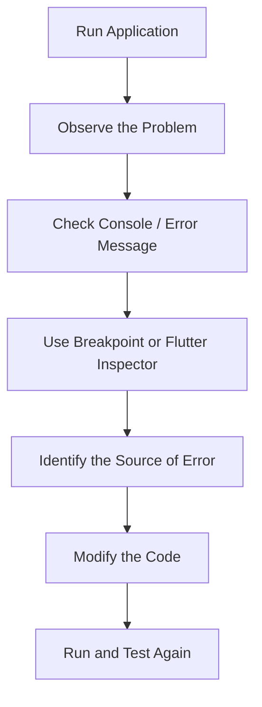
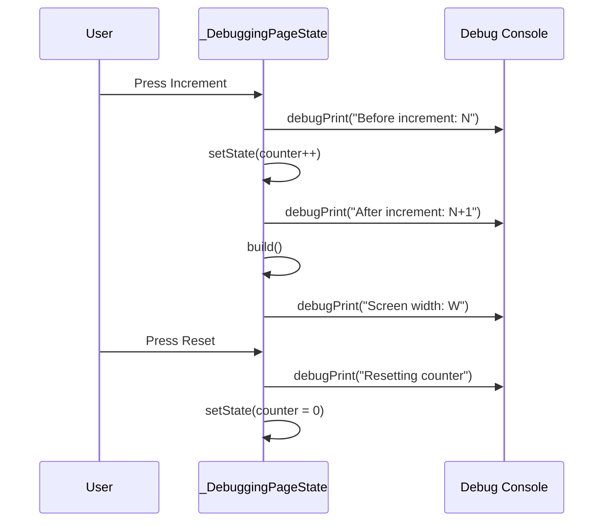

<div align="center">

# 🐞 Experiment 10(b) - Flutter Debugging Tools

### debugPrint() &nbsp;•&nbsp; Breakpoints &nbsp;•&nbsp; DevTools &nbsp;•&nbsp; Flutter Inspector

</div>

[](https://raw.githubusercontent.com/andreasbm/readme/master/assets/lines/rainbow.gif)

# 🎯 Aim

To use Flutter's debugging tools and techniques to identify, analyze, and fix common errors in a Flutter application.

[](https://raw.githubusercontent.com/andreasbm/readme/master/assets/lines/rainbow.gif)

# 📝 Description

**Debugging** is the process of finding and correcting errors in an application. Flutter provides several tools such as Flutter DevTools, the debugger, console logs, and widget inspection.

- `debugPrint()` displays useful debugging information in the console.
- **Breakpoints** allow program execution to pause at a particular line during debugging.
- **Flutter DevTools** provides tools for inspecting widgets, layouts, performance, memory, and application logs.
- The **Flutter Inspector** helps examine the widget tree and identify layout problems.
- Common Flutter issues include incorrect state updates, layout overflow, null values, and invalid widget configurations.
- Debugging tools can be used to locate the source of an error before applying a correction. After fixing the issue, the application should be tested again to verify the solution.

These debugging techniques are useful for developing reliable Flutter applications.

## 1️⃣ Debugging Tools and Techniques

| Tool / Technique | Purpose |
|------------------|---------|
| `debugPrint()` | Prints debugging information to the console |
| Breakpoints | Pauses program execution for inspection |
| Flutter Inspector | Examines the widget tree and layout |
| DevTools | Provides debugging, performance, and memory tools |
| Debug Console | Displays logs and runtime messages |
| `flutter analyze` | Detects Dart and Flutter code issues |
| `flutter run` | Runs the application in debug mode |

## 2️⃣ Useful Commands

| Purpose | Command |
|---------|---------|
| Check the project for code issues | `flutter analyze` |
| Run the application in debug mode | `flutter run` |
| Run tests | `flutter test` |
| Open Flutter DevTools while running the application | `dart devtools` |

## 3️⃣ Debugging Process



## 4️⃣ Program Structure

In this experiment, a counter application demonstrates debugging using console output. `DebuggingPage` is a `StatefulWidget` with `int counter = 0`, and the screen shows the heading *Debugging Example*, the text *Counter: N*, an *Increment* `ElevatedButton` and a *Reset* `OutlinedButton`.

| Method | What it does | Debug output |
|--------|--------------|--------------|
| `incrementCounter()` | Increases `counter` inside `setState()` | `Before increment: N` before the change and `After increment: N+1` after it |
| `resetCounter()` | Sets `counter` to `0` inside `setState()` | `Resetting counter` |
| `build()` | Builds the screen | `Screen width: W` (from `MediaQuery.sizeOf(context).width`) each time the widget is built |

> ℹ️ Your theory says `dispose()` is used in this program, and that the experiment identifies and fixes an issue. The supplied code has no `dispose()` method and contains no bug to fix. It is a working counter that demonstrates `debugPrint()` and correct `setState()` use. Breakpoints, DevTools and the Flutter Inspector are tools used while running it, not part of the code.
>
> Because `build()` also prints the screen width, `Screen width: ...` lines appear in the console in addition to the increment and reset messages.



> 💻 **Full source code:** [`source_code.dart`](./source_code.dart) (originally `lib/main.dart`)

## ✅ Result

Flutter debugging techniques and tools were successfully used to identify program behavior, inspect runtime information, and verify the corrected application.

[](https://raw.githubusercontent.com/andreasbm/readme/master/assets/lines/rainbow.gif)

# 📤 Output

> ⚠️ **Note:** No `output.xxxx` file was supplied. The output below is the expected output provided with the experiment, not a captured screenshot or console log. Add a screenshot of the app and of the Debug Console here once available.

Initially, the application displays:

```text
Debugging Example

Counter: 0

[ Increment ]
[ Reset ]
```

After pressing **Increment**:

```text
Counter: 1
```

The debug console displays information similar to:

```text
Before increment: 0
After increment: 1
```

Pressing **Reset** changes the counter back to `0` and prints a corresponding debugging message (`Resetting counter`).

<!--  -->

[](https://raw.githubusercontent.com/andreasbm/readme/master/assets/lines/rainbow.gif)
