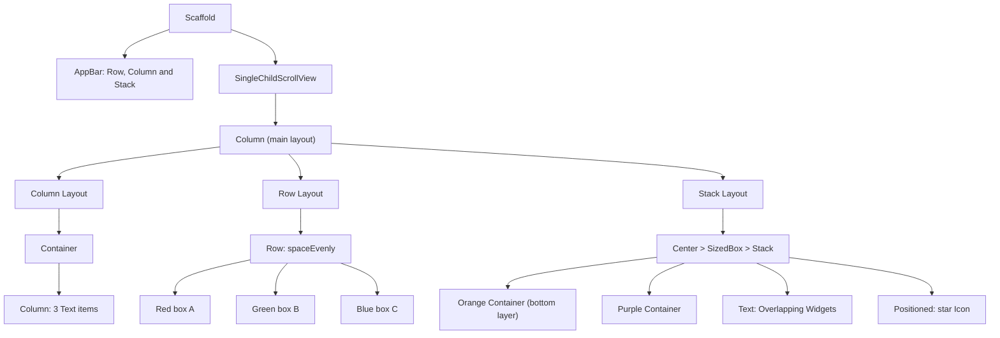

# 📐 Experiment 2(b) - Layout Structures using Row, Column and Stack

### Row &nbsp;•&nbsp; Column &nbsp;•&nbsp; Stack

# 🎯 Aim

To implement and understand different Flutter layout structures using the Row, Column, and Stack widgets.

# 📝 Description

Flutter provides **layout widgets** to arrange and position UI elements efficiently. Layout widgets can be nested inside one another to create complex interfaces.

## 1️⃣ Layout Widgets

| # | Widget | Purpose | Typical Use |
|---|--------|---------|-------------|
| 1️⃣ | `Row` | Arranges child widgets horizontally | Horizontal menus, buttons, information sections |
| 2️⃣ | `Column` | Arranges child widgets vertically | Forms, text and other vertically stacked widgets |
| 3️⃣ | `Stack` | Places widgets on top of one another | One widget overlapping another |

## 2️⃣ Important Properties and Widgets

| Item | Description |
|------|-------------|
| `mainAxisAlignment` | Controls the alignment of children along the main axis |
| `crossAxisAlignment` | Controls the alignment along the cross axis |
| `Positioned` | Controls the exact position of a child inside a `Stack` |
| `Center` | Positions its child at the center |
| `SizedBox` | Provides fixed width, height, or spacing |

> ℹ️ `Expanded` (distributes available space inside a `Row` or `Column`) is described in the theory but is not used in this program.

## 3️⃣ Program Structure

In this program, a `Column` is used as the main vertical layout inside a `SingleChildScrollView` (padding 16). It has three sections, each with a bold heading (font size 22):

| Section | Layout Used | Details in the program |
|---------|-------------|------------------------|
| **Column Layout** | `Column` | A bordered `Container` (padding 15, radius 10) holding three `Text` widgets: *First Item*, *Second Item*, *Third Item* |
| **Row Layout** | `Row` | `mainAxisAlignment: spaceEvenly` with three 80 × 80 boxes: red **A**, green **B**, blue **C** (white text) |
| **Stack Layout** | `Stack` | A 250 × 180 `SizedBox` (centered) with `alignment: Alignment.center`, holding an orange 250 × 180 box, a purple 160 × 120 box, the white bold text *Overlapping Widgets*, and a white star `Icon` (size 30) `Positioned` at `bottom: 10`, `right: 10` |

> 💻 **Full source code:** [`source_code.dart`](./source_code.dart)

## ✅ Result

Different Flutter layout structures were successfully implemented using Row, Column, and Stack widgets.

# 📤 Output

> ⚠️ **Note:** No `output.xxxx` file was supplied. The description below is the expected output provided with the experiment, not a captured screenshot. Add the screenshot here once available.

The application displays three layout sections:

1. **Column Layout** – Three text items arranged vertically.
2. **Row Layout** – Three colored boxes arranged horizontally.
3. **Stack Layout** – Multiple widgets overlapping each other, with a star icon positioned at the bottom-right.

<!--  -->

