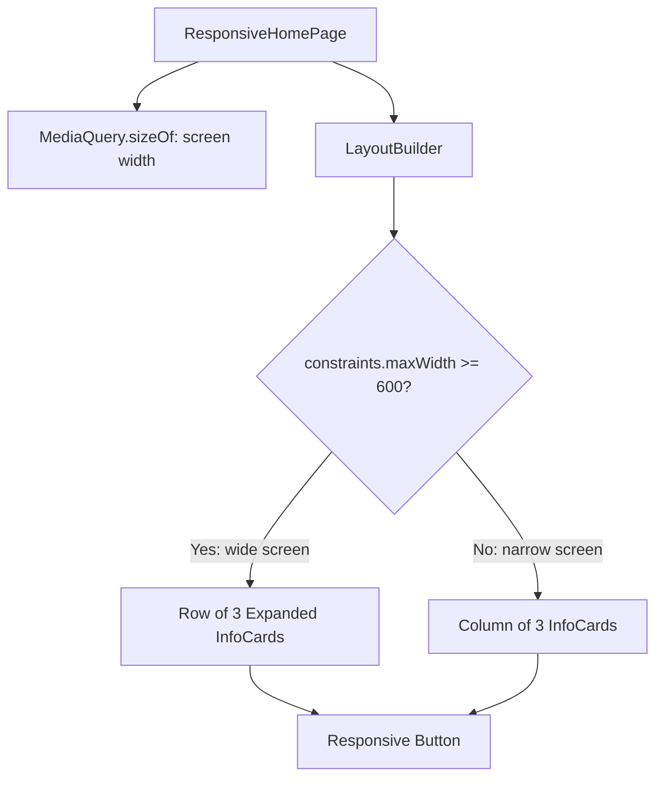

# 📱 Experiment 3(a) - Responsive UI for Different Screen Sizes

### MediaQuery &nbsp;•&nbsp; LayoutBuilder

# 🎯 Aim

To design and implement a responsive Flutter user interface that automatically adapts its layout to different screen sizes using MediaQuery and LayoutBuilder.

# 📝 Description

A **responsive UI** allows an application to provide a suitable layout on different screen sizes. The design uses flexible dimensions instead of fixed screen-dependent positions, so the same application can adapt to mobile, tablet, and larger displays. This approach improves usability and prevents layout overflow on different devices.

## 1️⃣ Responsive Tools in Flutter

| # | Tool | Purpose |
|---|------|---------|
| 1️⃣ | `MediaQuery` | Provides information about the current screen size and device characteristics |
| 2️⃣ | `LayoutBuilder` | Changes the UI based on the available space provided by its parent |
| 3️⃣ | `Expanded` | Lets child widgets share the available horizontal space |
| 4️⃣ | `Flexible` | Lets widgets adapt their size without overflowing |
| 5️⃣ | `GridView` | Can be used to create responsive grids |

> ℹ️ `Flexible` and `GridView` are described in the theory but are not used in this program.

## 2️⃣ Program Structure

In this program:

- The screen width is obtained using `MediaQuery.sizeOf(context).width` and displayed as *Screen width: N px*.
- A `LayoutBuilder` compares `constraints.maxWidth` with a **600 px breakpoint** to decide `isWideScreen`.
- The heading font size is 30 on wide screens and 24 on narrow screens.
- On **smaller screens**, the three `InfoCard` widgets are arranged vertically using a `Column` (16 px gaps).
- On **wider screens**, they are arranged horizontally using a `Row`, with each card wrapped in `Expanded` (16 px gaps).
- The content is wrapped in a `SingleChildScrollView` so it is not clipped on small screens.
- A full-width `ElevatedButton` labelled *Responsive Button* is shown below the cards.

The reusable `InfoCard` widget (a `Card` with an `Icon`, a bold title and a centered description) is used for:

| Card | Icon | Description text |
|------|------|------------------|
| Mobile | `Icons.phone_android` | Compact layout for small devices. |
| Tablet | `Icons.tablet` | Expanded layout for larger screens. |
| Desktop | `Icons.desktop_windows` | Wide layout for desktop displays. |

> 💻 **Full source code:** [`source_code.dart`](./source_code.dart)

## ✅ Result

A responsive Flutter UI that adapts its layout according to the available screen size was successfully designed and implemented.

# 📤 Output

> ⚠️ **Note:** No `output.xxxx` file was supplied. The description below is the expected output provided with the experiment, not a captured screenshot. Add screenshots of a narrow and a wide window here once available.

- On a small/mobile screen, the three information cards appear vertically.
- On a wide/tablet or desktop screen, the cards appear horizontally in a row.
- The heading and other elements adjust according to the available screen width.
- The UI remains usable without horizontal overflow on different screen sizes.

<!--  -->

