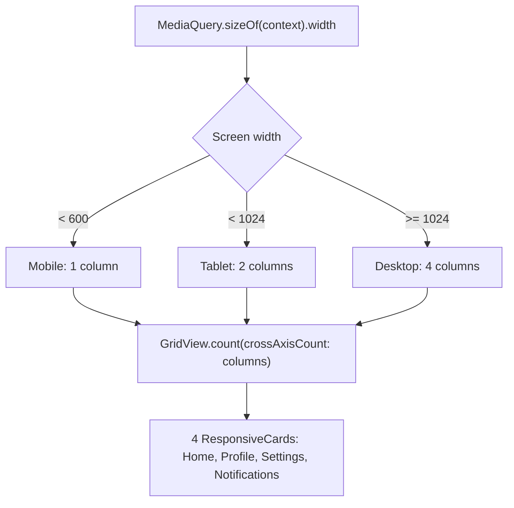

# 📏 Experiment 3(b) - Media Queries and Breakpoints for Responsiveness

### MediaQuery &nbsp;•&nbsp; Breakpoints &nbsp;•&nbsp; GridView.count

# 🎯 Aim

To implement media queries and breakpoints in Flutter to create a responsive user interface that adapts its layout and content to mobile, tablet, and desktop screen sizes.

# 📝 Description

**Responsive design** allows a Flutter application to adapt to different screen dimensions. Flutter provides `MediaQuery` to obtain information about the current device and screen, and `MediaQuery.sizeOf(context).width` can be used to determine the available screen width.

A **breakpoint** is a predefined width at which the application changes its layout. The MediaQuery width is compared with these breakpoints, so the same Flutter application can provide different layouts without creating separate applications. This approach prevents excessive empty space and improves usability on different devices.

## 1️⃣ Breakpoints Used

| Screen Width | Device Type | Grid Columns (`crossAxisCount`) |
|--------------|-------------|---------------------------------|
| `< 600 px` | 📱 Mobile | 1 |
| `600 – 1023 px` | 📲 Tablet | 2 |
| `≥ 1024 px` | 🖥️ Desktop | 4 |

## 2️⃣ Important Concepts

| Concept | Description |
|---------|-------------|
| `MediaQuery.sizeOf(context)` | Obtains the current available screen size |
| Breakpoint | A screen-width threshold used to change the UI layout |
| `GridView.count` | Creates a grid with a specified number of columns |
| `crossAxisCount` | Determines the number of columns in the grid |
| Conditional statements | Select the appropriate layout based on the screen width |

## 3️⃣ Program Structure

- `ResponsiveHomePage` reads the width with `MediaQuery.sizeOf(context).width`.
- An `if / else if / else` chain sets `deviceType` and `columns` according to the breakpoints above.
- The page shows the heading *Media Query & Breakpoints*, then *Screen Width: N px* and a bold *Device Type: ...* line.
- A `GridView.count` inside an `Expanded` displays four `ResponsiveCard` widgets (*Home*, *Profile*, *Settings*, *Notifications*) with `crossAxisSpacing` and `mainAxisSpacing` of 16 and `childAspectRatio` of 1.2.
- Each `ResponsiveCard` is a `Card` (elevation 4) with an icon (size 45) and a bold title.

> ℹ️ In the code, only the number of columns changes between breakpoints. `childAspectRatio` is fixed at 1.2, so card sizes change only because each card fills a different column width.

> 💻 **Full source code:** [`source_code.dart`](./source_code.dart)

## ✅ Result

Media queries and responsive breakpoints were successfully implemented to create an adaptive Flutter user interface.

# 📤 Output

> ⚠️ **Note:** No `output.xxxx` file was supplied. The description below is the expected output provided with the experiment, not a captured screenshot. Add screenshots for mobile, tablet and desktop widths here once available.

| Device | Expected Layout |
|--------|-----------------|
| Mobile | Cards are displayed in a single-column layout |
| Tablet | Cards are displayed in two columns |
| Desktop | Cards are displayed in four columns |

The displayed device type and screen width change automatically when the application runs on different screen sizes.

<!--  -->

