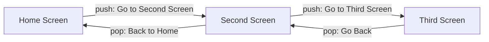
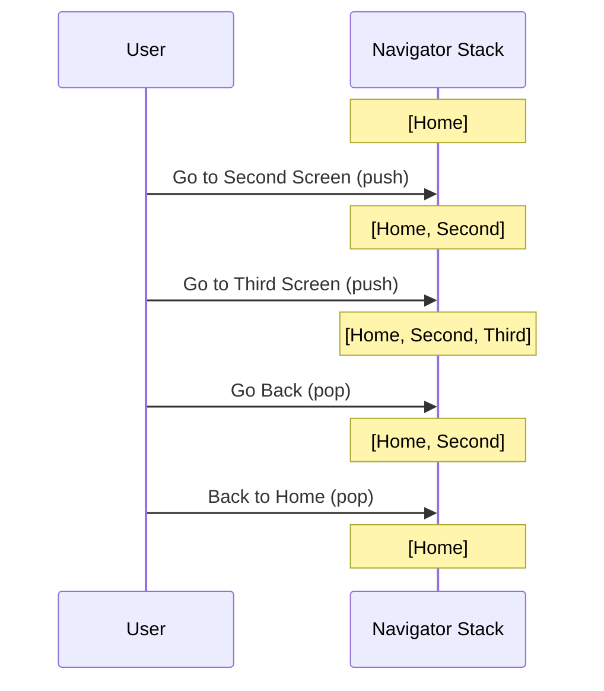

<div align="center">

# 🧭 Experiment 4(a) - Navigation Between Screens using Navigator

### Navigator.push() &nbsp;•&nbsp; Navigator.pop() &nbsp;•&nbsp; MaterialPageRoute

</div>

[](https://raw.githubusercontent.com/andreasbm/readme/master/assets/lines/rainbow.gif)

# 🎯 Aim

To implement navigation between multiple screens in a Flutter application using the Navigator widget and navigation methods such as push() and pop().

[](https://raw.githubusercontent.com/andreasbm/readme/master/assets/lines/rainbow.gif)

# 📝 Description

**Navigation** allows users to move between different screens of a Flutter application. Flutter provides the `Navigator` widget to manage a **stack of routes**, and each screen can be represented as a route in that stack.

When a new screen is pushed, it appears above the current screen. Pressing a back button or calling `pop()` returns to the previous screen. The `BuildContext` is required to access the nearest `Navigator`, and the `AppBar` provides a back button automatically when appropriate.

This approach is useful for simple applications with direct screen-to-screen navigation. Flutter also supports **named routes** for applications with a larger number of screens.

## 1️⃣ Important Navigator Methods

| Method | Purpose |
|--------|---------|
| `Navigator.push()` | Adds a new route and opens another screen |
| `Navigator.pop()` | Removes the current route and returns to the previous screen |
| `MaterialPageRoute` | Creates a Material-style route for a screen (Material Design transition) |
| `BuildContext` | Provides access to the current widget's navigation context |

> ℹ️ Named routes are mentioned in the theory but are not used in this program.

## 2️⃣ Program Structure

Three screens are created, each a `StatelessWidget` built with a `Scaffold` and an `AppBar`:

| Screen | Content | Navigation |
|--------|---------|------------|
| **HomeScreen** (`home` of `MaterialApp`) | A centered *Go to Second Screen* `ElevatedButton` | `push()` → `SecondScreen` |
| **SecondScreen** | Text *Welcome to the Second Screen*, *Go to Third Screen* `ElevatedButton` and *Back to Home* `OutlinedButton` | `push()` → `ThirdScreen`; `pop()` → previous screen (Home) |
| **ThirdScreen** | Text *Welcome to the Third Screen* and a *Go Back* `ElevatedButton` | `pop()` → previous screen (Second) |

> ℹ️ Your theory says buttons on each screen navigate to the next screen. In the code, `ThirdScreen` is the last screen: its only button goes back one screen.



The navigation stack changes as follows:



> 💻 **Full source code:** [`source_code.dart`](./source_code.dart)

## ✅ Result

Navigation between multiple Flutter screens was successfully implemented using the Navigator widget.

[](https://raw.githubusercontent.com/andreasbm/readme/master/assets/lines/rainbow.gif)

# 📤 Output

> ⚠️ **Note:** No `output.xxxx` file was supplied. The description below is the expected output provided with the experiment, not a captured screenshot. Add screenshots of the three screens here once available.

The application initially displays the Home Screen.

```text
Home Screen
     |
     | Go to Second Screen
     ↓
Second Screen
     |
     | Go to Third Screen
     ↓
Third Screen
```

The user can use the Back buttons or `Navigator.pop()` to return to the previous screens.

<!--  -->

[](https://raw.githubusercontent.com/andreasbm/readme/master/assets/lines/rainbow.gif)
