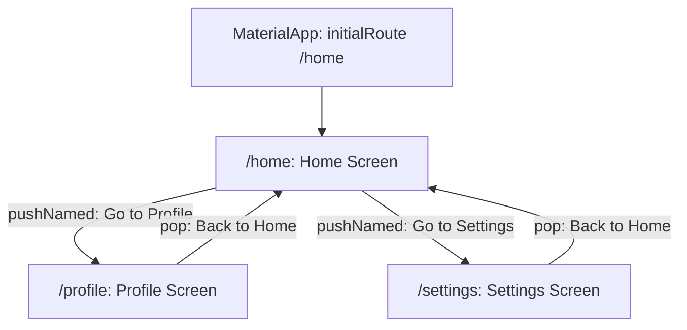

<div align="center">

# 🗺️ Experiment 4(b) - Navigation with Named Routes

### routes &nbsp;•&nbsp; initialRoute &nbsp;•&nbsp; Navigator.pushNamed()

</div>

[](https://raw.githubusercontent.com/andreasbm/readme/master/assets/lines/rainbow.gif)

# 🎯 Aim

To implement navigation between multiple screens in a Flutter application using named routes and the Navigator widget.

[](https://raw.githubusercontent.com/andreasbm/readme/master/assets/lines/rainbow.gif)

# 📝 Description

**Named routes** provide a convenient way to identify and navigate between different screens. Each route is assigned a unique string name such as `/home` or `/profile`, and each named route maps to a widget through a `WidgetBuilder`.

Routes are defined in the `routes` property of the `MaterialApp` widget, and the initial screen can be specified using the `initialRoute` property. Because named routes separate route definitions from the code that performs navigation, navigation is easier to manage when an application contains multiple screens. The `AppBar` can also provide a back button automatically on pushed routes.

Named routes are suitable for simple and moderately sized Flutter applications. For more complex applications, Flutter also provides advanced routing approaches.

## 1️⃣ Important Concepts

| Concept | Description |
|---------|-------------|
| `routes` | Defines the named routes and their corresponding screens |
| `initialRoute` | Specifies the first route displayed when the application starts |
| `Navigator.pushNamed()` | Opens a screen using its registered route name |
| `Navigator.pop()` | Returns to the previous screen |
| Route name | A unique string used to identify a screen, such as `/profile` |

## 2️⃣ Program Structure

`MaterialApp` sets `initialRoute: '/home'` and registers three routes:

| Route | Screen | Content | Navigation |
|-------|--------|---------|------------|
| `/home` | `HomeScreen` | Text *Welcome to the Home Screen*, *Go to Profile* and *Go to Settings* buttons | `pushNamed('/profile')`, `pushNamed('/settings')` |
| `/profile` | `ProfileScreen` | A centered *Back to Home* button | `pop()` |
| `/settings` | `SettingsScreen` | A centered *Back to Home* button | `pop()` |



> 💻 **Full source code:** [`source_code.dart`](./source_code.dart)

## ✅ Result

Navigation between multiple Flutter screens was successfully implemented using named routes.

[](https://raw.githubusercontent.com/andreasbm/readme/master/assets/lines/rainbow.gif)

# 📤 Output

> ⚠️ **Note:** No `output.xxxx` file was supplied. The description below is the expected output provided with the experiment, not a captured screenshot. Add screenshots of the three screens here once available.

The application starts on the Home Screen. Selecting **Go to Profile** opens the Profile screen, while selecting **Go to Settings** opens the Settings screen. The back button returns the user to the previous screen.

```text
                 ┌───────────────┐
                 │  Home Screen  │
                 └───────┬───────┘
                         │
              ┌──────────┴──────────┐
              ↓                     ↓
      ┌───────────────┐     ┌───────────────┐
      │ Profile Screen│     │Settings Screen│
      └───────────────┘     └───────────────┘
```

<!--  -->

[](https://raw.githubusercontent.com/andreasbm/readme/master/assets/lines/rainbow.gif)
