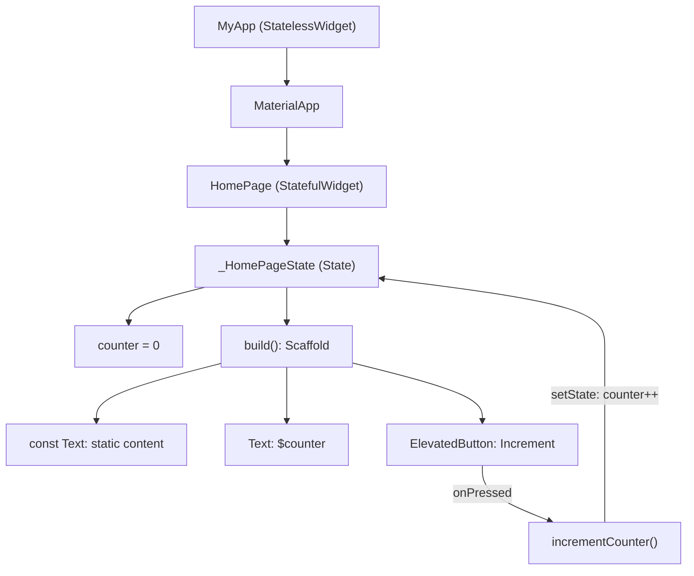

<div align="center">

# 🔄 Experiment 5(a) - Stateful and Stateless Widgets

### StatelessWidget &nbsp;•&nbsp; StatefulWidget &nbsp;•&nbsp; setState()

</div>

[](https://raw.githubusercontent.com/andreasbm/readme/master/assets/lines/rainbow.gif)

# 🎯 Aim

To understand the difference between StatelessWidget and StatefulWidget in Flutter and demonstrate their usage in a simple application.

[](https://raw.githubusercontent.com/andreasbm/readme/master/assets/lines/rainbow.gif)

# 📝 Description

Flutter applications are built using **widgets**, which describe the user interface. The `StatelessWidget` and `StatefulWidget` concepts are fundamental to building interactive Flutter applications.

## 1️⃣ StatelessWidget

A `StatelessWidget` is a widget whose properties do not change during its lifetime. It is suitable for displaying static content such as labels, icons, and fixed layouts. Its `build()` method describes the UI that should be displayed.

## 2️⃣ StatefulWidget

A `StatefulWidget` is used when the UI needs to change during the lifetime of the widget. It consists of two classes: the `StatefulWidget` class and its associated `State` class.

- The `State` object stores values that can change while the application is running.
- The `setState()` method notifies Flutter that the state has changed.
- When `setState()` is called, Flutter rebuilds the affected widget and updates the UI.

## 3️⃣ Difference Between StatelessWidget and StatefulWidget

| Feature | StatelessWidget | StatefulWidget |
|---------|-----------------|----------------|
| State | Immutable | Can change |
| `build()` | Describes fixed UI | Rebuilds when state changes |
| `setState()` | Not used | Used to update state |
| Use case | Static content | Interactive/dynamic content |
| Example | `Text`, `Icon` | Counter, form, checkbox |

## 4️⃣ Program Structure

| Class | Type | Role in the program |
|-------|------|---------------------|
| `MyApp` | `StatelessWidget` | Builds the `MaterialApp` and sets `HomePage` as `home` |
| `HomePage` | `StatefulWidget` | Creates its state through `createState()` |
| `_HomePageState` | `State<HomePage>` | Holds `int counter = 0` and `incrementCounter()`, which calls `setState(() { counter++; })` |

The `Scaffold` (`AppBar` title *Stateful & Stateless*) shows, in a centered `Column`:

- A constant `Text` *This is a Stateless Text Widget* (font size 18, bold), which never changes.
- A constant `Text` *Counter Value*, followed by a `Text` showing `'$counter'` (font size 40, bold), which changes when the state changes.
- An `ElevatedButton` labelled *Increment* with `onPressed: incrementCounter`.

> ℹ️ The only class that extends `StatelessWidget` in this program is `MyApp`. The *Stateless Text Widget* label is a `const Text` inside the stateful `HomePage`'s `build()` method. It stays the same on screen because its content is constant.



> 💻 **Full source code:** [`source_code.dart`](./source_code.dart)

## ✅ Result

The concepts and implementation of StatelessWidget and StatefulWidget were successfully demonstrated.

[](https://raw.githubusercontent.com/andreasbm/readme/master/assets/lines/rainbow.gif)

# 📤 Output

> ⚠️ **Note:** No `output.xxxx` file was supplied. The description below is the expected output provided with the experiment, not a captured screenshot. Add screenshots of the initial screen and after pressing *Increment* here once available.

Initially, the application displays:

```text
Stateful & Stateless

This is a Stateless Text Widget

Counter Value
     0

[ Increment ]
```

Each time the **Increment** button is pressed, the counter value increases:

```text
0 → 1 → 2 → 3 → ...
```

The text describing the stateless widget remains unchanged, while the counter demonstrates the changing state.

<!--  -->

[](https://raw.githubusercontent.com/andreasbm/readme/master/assets/lines/rainbow.gif)
