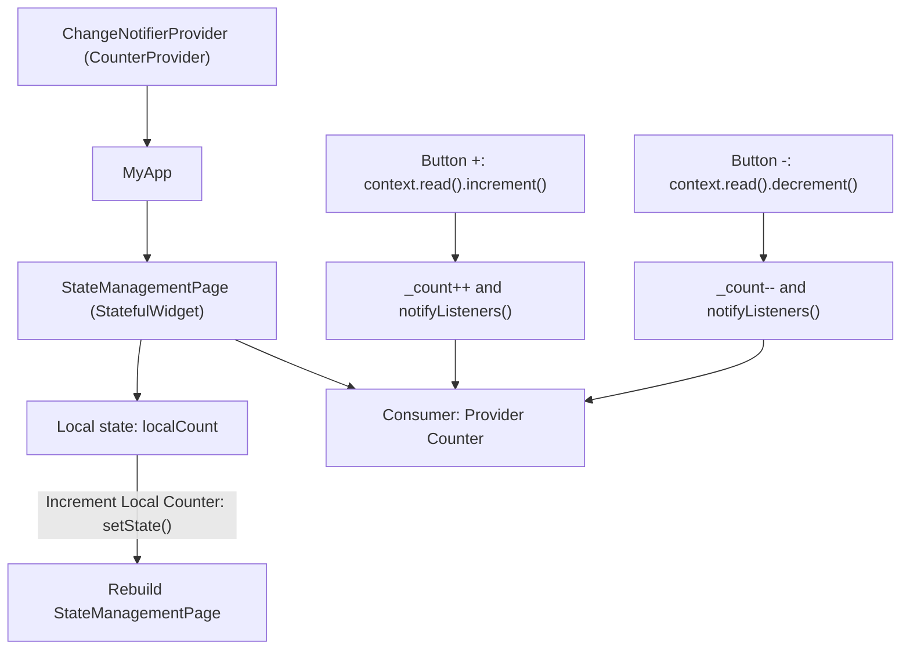

<div align="center">

# 🧠 Experiment 5(b) - State Management using setState and Provider

### setState() &nbsp;•&nbsp; Provider &nbsp;•&nbsp; ChangeNotifier

</div>

[](https://raw.githubusercontent.com/andreasbm/readme/master/assets/lines/rainbow.gif)

# 🎯 Aim

To implement and understand two state-management approaches in Flutter, namely setState() for local state management and Provider for shared application state.

[](https://raw.githubusercontent.com/andreasbm/readme/master/assets/lines/rainbow.gif)

# 📝 Description

**State management** controls how changing data is stored and reflected in the Flutter user interface. This experiment covers two approaches:

| # | Approach | Scope | Suitable For |
|---|----------|-------|--------------|
| 1️⃣ | `setState()` | Local state inside a `StatefulWidget` | Simple state that belongs to a single screen or widget |
| 2️⃣ | `Provider` | Shared application state | State that needs to be accessed by multiple widgets |

## 1️⃣ setState()

`setState()` is a built-in Flutter method used to update local state inside a `StatefulWidget`. When `setState()` is called, Flutter rebuilds the affected widget.

## 2️⃣ Provider

Provider is a popular state-management solution based on Flutter's widget tree and `ChangeNotifier`.

- A `ChangeNotifier` class stores application state and notifies listeners when the state changes.
- `ChangeNotifierProvider` makes a state object available to descendant widgets.
- `Consumer` listens to changes in the provider and rebuilds the required part of the UI.
- `notifyListeners()` informs Provider listeners that the shared state has changed.

## 3️⃣ Dependency

The Provider package must be added to `pubspec.yaml` before using Provider classes:

```yaml
dependencies:
  flutter:
    sdk: flutter
  provider: ^6.1.5+1
```

Then run:

```bash
flutter pub get
```

## 4️⃣ Important Concepts

| Concept | Purpose |
|---------|---------|
| `setState()` | Updates local widget state |
| `StatefulWidget` | Holds mutable local state |
| `ChangeNotifier` | Stores and manages shared state |
| `notifyListeners()` | Notifies Provider listeners about state changes |
| `ChangeNotifierProvider` | Provides state to descendant widgets |
| `Consumer` | Rebuilds UI when provider state changes |
| `context.read()` | Accesses provider without listening for changes |

## 5️⃣ Program Structure

- `main()` wraps `MyApp` in a `ChangeNotifierProvider` that creates a `CounterProvider`.
- `CounterProvider` (extends `ChangeNotifier`) keeps a private `_count`, exposes it through the `count` getter, and has `increment()` and `decrement()` methods that each call `notifyListeners()`.
- `StateManagementPage` is a `StatefulWidget`. Its state class holds `int localCount` and `incrementLocalCount()`, which calls `setState()`.
- **Section 1 (setState):** a `Text` *Local Counter: N* and an *Increment Local Counter* button.
- **Section 2 (Provider):** a `Consumer<CounterProvider>` shows *Provider Counter: N*. The `-` and `+` buttons call `context.read<CounterProvider>().decrement()` and `.increment()`.

> ℹ️ Your theory says Provider is useful when several widgets access the same state. In this program, only the one `Consumer` reads the shared counter, and the `-` and `+` buttons only change it through `context.read()`.



> 💻 **Full source code:** [`source_code.dart`](./source_code.dart)

## ✅ Result

State management using both Flutter's built-in setState() and the Provider package was successfully implemented.

[](https://raw.githubusercontent.com/andreasbm/readme/master/assets/lines/rainbow.gif)

# 📤 Output

> ⚠️ **Note:** No `output.xxxx` file was supplied. The description below is the expected output provided with the experiment, not a captured screenshot. Add screenshots of the initial screen and after pressing the buttons here once available.

The application displays two counters:

```text
State Management

1. Using setState()

Local Counter: 0
[ Increment Local Counter ]

--------------------------------

2. Using Provider

Provider Counter: 0

[ - ]       [ + ]
```

- Pressing **Increment Local Counter** updates the counter using `setState()`.
- Pressing **+** or **-** updates the shared counter using Provider.

<!--  -->

[](https://raw.githubusercontent.com/andreasbm/readme/master/assets/lines/rainbow.gif)
