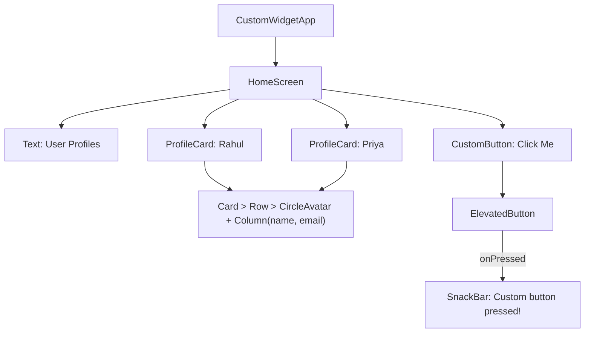

<div align="center">

# 🧱 Experiment 6(a) - Custom Widgets for Specific UI Elements

### ProfileCard &nbsp;•&nbsp; CustomButton &nbsp;•&nbsp; Reusable Widgets

</div>

[](https://raw.githubusercontent.com/andreasbm/readme/master/assets/lines/rainbow.gif)

# 🎯 Aim

To create and use custom reusable widgets in Flutter for designing specific UI elements and improving code reusability and maintainability.

[](https://raw.githubusercontent.com/andreasbm/readme/master/assets/lines/rainbow.gif)

# 📝 Description

Flutter allows developers to create their own widgets for specific UI requirements. Custom widgets can be created by extending `StatelessWidget` or `StatefulWidget`, and a `StatelessWidget` is suitable when the custom UI does not maintain changing state.

## 1️⃣ Why Custom Widgets?

- They divide a large user interface into smaller, manageable components.
- They can be reused multiple times within the same application.
- Properties can be passed to them through their constructors, so multiple instances of the same custom widget can have different values.
- They improve readability by keeping the main screen code simple, and make UI components easier to modify and maintain.

This demonstrates the basic technique of creating reusable UI components in Flutter.

## 2️⃣ Important Concepts

| Concept | Description |
|---------|-------------|
| Custom Widget | A developer-defined widget used to represent a reusable UI component |
| `StatelessWidget` | Used when the custom widget does not require mutable state |
| Constructor parameters | Allow different data to be passed to each widget instance |
| `required` | Ensures that important constructor values are provided |
| `VoidCallback` | Represents a function that takes no arguments and returns no value |
| `const` | Allows widgets with immutable values to be created as compile-time constants |
| Widget composition | Combines existing Flutter widgets to create a new custom widget |

## 3️⃣ Program Structure

Two custom widgets are defined, both extending `StatelessWidget`:

| Custom Widget | Parameters | Built From |
|---------------|------------|------------|
| `ProfileCard` | `name`, `email`, `icon`, `color` | `Card` (elevation 4) → `Padding` → `Row` with a `CircleAvatar` (radius 30, background `color`, white `Icon`) and an `Expanded` `Column` holding the bold `name` and the `email` |
| `CustomButton` | `text`, `onPressed` (`VoidCallback`) | A full-width `SizedBox` wrapping an `ElevatedButton` |

`HomeScreen` uses them as follows:

| Instance | Values |
|----------|--------|
| `ProfileCard` 1 | Rahul, `rahul@example.com`, `Icons.person`, `Colors.blue` |
| `ProfileCard` 2 | Priya, `priya@example.com`, `Icons.person`, `Colors.purple` |
| `CustomButton` | Text *Click Me*; `onPressed` shows a `SnackBar` with *Custom button pressed!* |

> ℹ️ `StatefulWidget` is mentioned in the theory but is not used in this program. Both custom widgets are stateless.



> 💻 **Full source code:** [`source_code.dart`](./source_code.dart)

## ✅ Result

Custom reusable widgets were successfully created and used to build specific UI elements in Flutter.

[](https://raw.githubusercontent.com/andreasbm/readme/master/assets/lines/rainbow.gif)

# 📤 Output

> ⚠️ **Note:** No `output.xxxx` file was supplied. The description below is the expected output provided with the experiment, not a captured screenshot. Add a screenshot of the screen, and of the SnackBar after pressing *Click Me*, here once available.

The application displays:

```text
          Custom Widgets

          User Profiles

   👤   Rahul
        rahul@example.com

   👤   Priya
        priya@example.com

        [ Click Me ]
```

Each profile is created using the reusable `ProfileCard` widget, while the button is created using the reusable `CustomButton` widget.

<!--  -->

[](https://raw.githubusercontent.com/andreasbm/readme/master/assets/lines/rainbow.gif)
