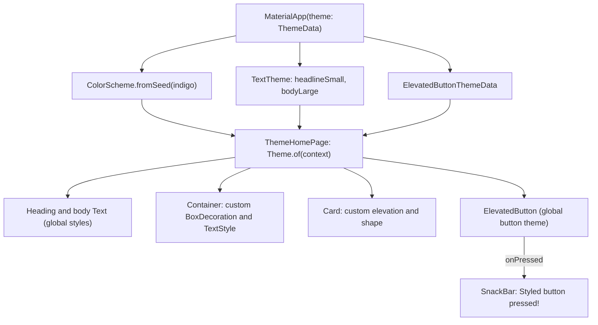

# 🎨 Experiment 6(b) - Styling using Themes and Custom Styles

### ThemeData &nbsp;•&nbsp; ColorScheme &nbsp;•&nbsp; TextTheme &nbsp;•&nbsp; Custom Styles

# 🎯 Aim

To apply global themes and custom styles in Flutter to create a consistent and visually appealing user interface.

# 📝 Description

Flutter provides the `ThemeData` class to define the overall appearance of an application. A theme can specify colors, typography, button styles, app bar styles, and other visual properties. The `ThemeData` object is usually provided through the `theme` property of `MaterialApp`, and widgets can access the current theme using `Theme.of(context)`.

Global theme settings reduce the need to style each widget individually, while individual widgets can override the global theme when a different appearance is required. This experiment demonstrates both **global theme styling** and **custom widget-level styling**.

## 1️⃣ Styling Concepts

| Concept | Purpose |
|---------|---------|
| `ThemeData` | Defines the application's overall theme |
| `ColorScheme` | Provides a consistent set of colors for Material widgets |
| `TextTheme` | Defines reusable text styles such as `titleLarge` and `bodyLarge` |
| `TextStyle` | Provides custom text formatting (font size, weight, letter spacing) |
| `Theme.of(context)` | Accesses the current application theme |
| `ButtonStyle` / `ElevatedButtonThemeData` | Customizes button appearance |
| `BoxDecoration` | Styles containers with colors, borders, and corners |
| `Card` | Creates an elevated Material card; can be styled with `elevation` and `shape` |

## 2️⃣ Program Structure

### 🌐 Global Theme (in `MaterialApp`)

| Setting | Value in the program |
|---------|----------------------|
| `useMaterial3` | `true` |
| `colorScheme` | `ColorScheme.fromSeed(seedColor: Colors.indigo)` |
| `textTheme.headlineSmall` | Font size 28, bold |
| `textTheme.bodyLarge` | Font size 18 |
| `elevatedButtonTheme` | `ElevatedButton.styleFrom` with padding (horizontal 30, vertical 14) and text style (size 16, bold) |

### 🖌️ Widget-Level Styling (in `ThemeHomePage`)

| Widget | Styling applied |
|--------|-----------------|
| Heading `Text` | Uses `theme.textTheme.headlineSmall` (global) |
| Body `Text` | Uses `theme.textTheme.bodyLarge` (global) |
| `Container` | Custom `BoxDecoration`: `primaryContainer` color, radius 15, 2 px `primary` border; text uses `onPrimaryContainer`, size 20, bold, `letterSpacing: 1.2` |
| `Card` | Custom `elevation: 5` and `RoundedRectangleBorder` (radius 15), containing a `Icons.palette` icon and the text *Custom Card Style* |
| `ElevatedButton` | Uses the global button theme; shows a `SnackBar` *Styled button pressed!* when pressed |

> ℹ️ Your theory mentions `titleLarge` as a sample `TextTheme` style, but the program defines only `headlineSmall` and `bodyLarge`. The `AppBar` and `Card` are not given a global theme in the code. The `Card` is styled directly on the widget.

> 💻 **Full source code:** [`source_code.dart`](./source_code.dart)

## ✅ Result

Global themes and custom styles were successfully applied to Flutter widgets to create a consistent and customized user interface.

# 📤 Output

> ⚠️ **Note:** No `output.xxxx` file was supplied. The description below is the expected output provided with the experiment, not a captured screenshot. Add a screenshot of the screen, and of the SnackBar after pressing *Styled Button*, here once available.

The application displays:

- A themed `AppBar`.
- A large styled heading.
- Body text using the global `TextTheme`.
- A customized colored container with rounded corners and a border.
- A styled card containing an icon and text.
- A themed `ElevatedButton`.

Pressing the button displays a `SnackBar` message.

<!--  -->

