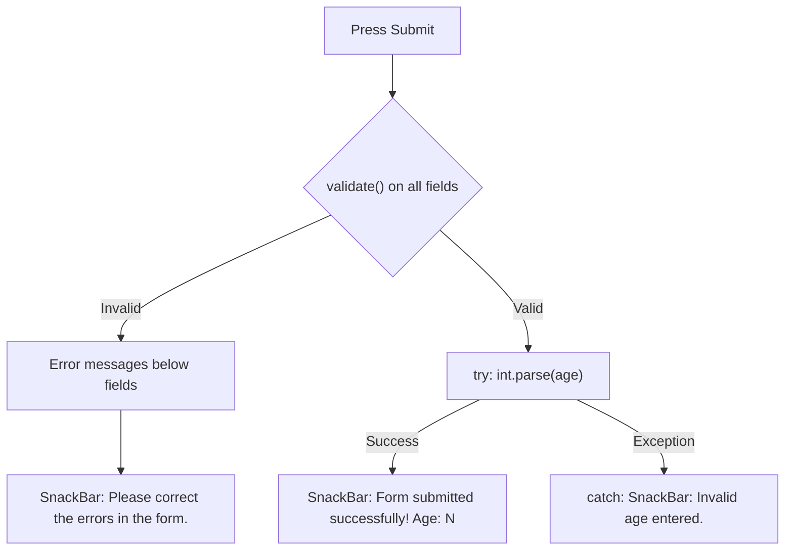

<div align="center">

# 🛡️ Experiment 7(b) - Form Validation and Error Handling

### Form &nbsp;•&nbsp; TextFormField &nbsp;•&nbsp; GlobalKey&lt;FormState&gt; &nbsp;•&nbsp; Validators

</div>

[](https://raw.githubusercontent.com/andreasbm/readme/master/assets/lines/rainbow.gif)

# 🎯 Aim

To implement form validation and error handling in Flutter using Form, TextFormField, GlobalKey<FormState>, and validator functions.

[](https://raw.githubusercontent.com/andreasbm/readme/master/assets/lines/rainbow.gif)

# 📝 Description

**Form validation** ensures that the data entered by the user meets the required conditions. Flutter provides the `Form` widget to group and manage multiple form fields, and `GlobalKey<FormState>` is used to access the current state of the form.

## 1️⃣ How Validation Works

- The `TextFormField` widget provides a `validator` property for validating input.
- A validator function returns an **error message** when the entered data is invalid, and returns `null` if the input is valid.
- Calling `formKey.currentState!.validate()` validates all fields in the form.
- Error messages are automatically displayed below the corresponding fields.
- `TextEditingController` is used to read the values entered by the user.

## 2️⃣ Important Concepts

| Concept | Purpose |
|---------|---------|
| `Form` | Groups and manages form fields |
| `GlobalKey<FormState>` | Accesses the form state |
| `validator` | Checks whether input is valid |
| `validate()` | Runs all field validators |
| `TextEditingController` | Reads entered values |
| `int.tryParse()` | Safely converts text to an integer |
| `SnackBar` | Displays feedback messages |
| `try-catch` | Handles unexpected runtime errors |

## 3️⃣ Validation Rules

In this program, the name, email, password and age fields are validated:

| Field | Validation | Error messages |
|-------|------------|----------------|
| 👤 Name | Required and minimum 3 characters | *Name is required*; *Name must contain at least 3 characters* |
| 📧 Email | Required and valid email format (`RegExp(r'^[^@\s]+@[^@\s]+\.[^@\s]+$')`) | *Email is required*; *Enter a valid email address* |
| 🔒 Password | Required and minimum 6 characters (`obscureText: true`) | *Password is required*; *Password must contain at least 6 characters* |
| 🎂 Age | Required, numeric, and between 5 and 100 | *Age is required*; *Age must be a number*; *Enter an age between 5 and 100* |

## 4️⃣ Submit and Error Handling

The `submitForm()` method works as follows:

1. If `validate()` fails, a `SnackBar` shows *Please correct the errors in the form.* and submission stops.
2. Otherwise, a `try` block converts the age text with `int.parse()` and shows a `SnackBar` *Form submitted successfully! Age: N*.
3. If the conversion throws, the `catch` block shows a `SnackBar` *Invalid age entered.*



> ℹ️ The age validator already confirms the value is numeric using `int.tryParse()`, so the `catch` branch is only a safeguard against unexpected conversion errors.

> 💻 **Full source code:** [`source_code.dart`](./source_code.dart)

## ✅ Result

Form validation and error handling were successfully implemented using Flutter's form widgets and validation mechanisms.

[](https://raw.githubusercontent.com/andreasbm/readme/master/assets/lines/rainbow.gif)

# 📤 Output

> ⚠️ **Note:** No `output.xxxx` file was supplied. The description below is the expected output provided with the experiment, not a captured screenshot. Add screenshots of the validation errors and the success SnackBar here once available.
>
> The supplied success text is *Form submitted successfully!*, but the code's SnackBar also appends the age (*Form submitted successfully! Age: N*).

When invalid data is entered, appropriate error messages appear below the fields:

```text
Name is required
Email is required
Password must contain at least 6 characters
Age must be a number
```

When all fields contain valid data, the application displays:

```text
Form submitted successfully!
```

<!--  -->

[](https://raw.githubusercontent.com/andreasbm/readme/master/assets/lines/rainbow.gif)
