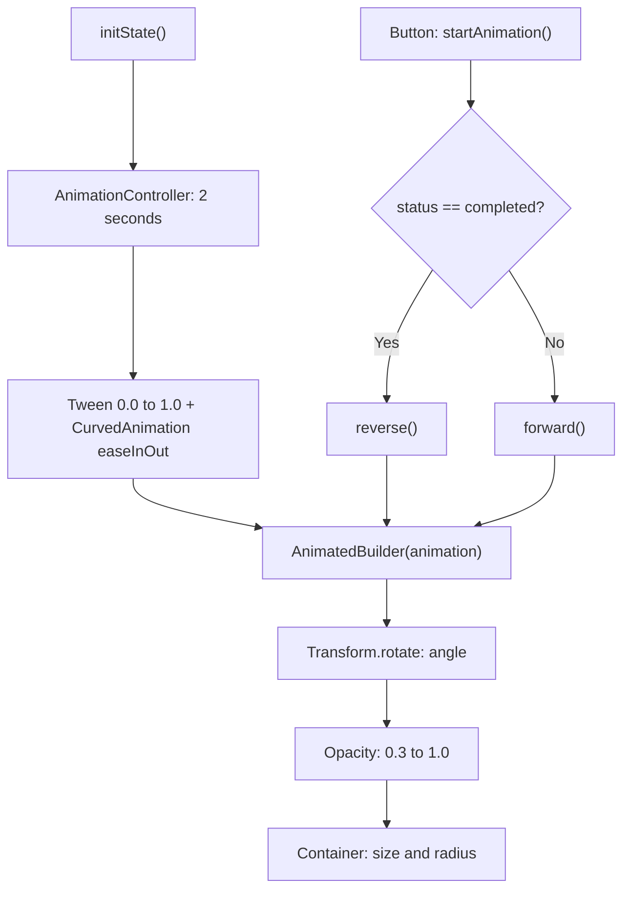

<div align="center">

# 🎞️ Experiment 8(a) - Animations using Flutter's Animation Framework

### AnimationController &nbsp;•&nbsp; Tween &nbsp;•&nbsp; AnimatedBuilder

</div>

[](https://raw.githubusercontent.com/andreasbm/readme/master/assets/lines/rainbow.gif)

# 🎯 Aim

To implement animations in Flutter using the AnimationController, Tween, and AnimatedBuilder classes to create an interactive and visually dynamic user interface.

[](https://raw.githubusercontent.com/andreasbm/readme/master/assets/lines/rainbow.gif)

# 📝 Description

Flutter provides a powerful **animation framework** for creating smooth UI animations. An animation changes a widget's properties over a specified period of time.

## 1️⃣ Animation Classes

| Class / Widget | Purpose |
|----------------|---------|
| `AnimationController` | Controls the duration and playback of an animation |
| `Tween` | Defines the starting and ending values of an animated property |
| `CurvedAnimation` | Applies a curve to control the animation's rate of change |
| `AnimatedBuilder` | Rebuilds a portion of the UI whenever the animation value changes |
| `Transform.rotate` | Rotates a widget |
| `Opacity` | Controls the transparency of a widget |
| `SingleTickerProviderStateMixin` | Provides a ticker for the animation controller |
| `dispose()` | Releases animation resources when the widget is removed, preventing resource leaks |

The `forward()` method starts the animation from the beginning, and the `reverse()` method plays it in the opposite direction.

## 2️⃣ Program Structure

`AnimationHomePage` is a `StatefulWidget` whose state uses `SingleTickerProviderStateMixin`. In `initState()`:

- An `AnimationController` is created with a duration of **2 seconds**.
- A `Tween<double>(begin: 0.0, end: 1.0)` is animated through a `CurvedAnimation` using `Curves.easeInOut`.

An `AnimatedBuilder` rebuilds the animated element on every animation value `v` (from 0.0 to 1.0):

| Property | Formula in the program | Start (v = 0) | End (v = 1) |
|----------|------------------------|---------------|-------------|
| Rotation (`Transform.rotate`) | `v * 2 * 3.14159` (radians) | 0 | about one full turn |
| Opacity (`Opacity`) | `0.3 + (v * 0.7)` | 0.3 | 1.0 |
| Width and height (`Container`) | `100 + (v * 100)` | 100 | 200 |
| Corner radius (`BoxDecoration`) | `10 + (v * 40)` | 10 | 50 |

The container is blue and holds a white `Icons.flutter_dash` icon (size 50).

The *Start / Reverse Animation* button calls `startAnimation()`: if the controller status is `AnimationStatus.completed`, it calls `reverse()`; otherwise it calls `forward()`. The controller is disposed in `dispose()`.

> ℹ️ The corner radius also changes during the animation, in addition to the size, rotation and opacity mentioned in the theory.



> 💻 **Full source code:** [`source_code.dart`](./source_code.dart)

## ✅ Result

Animation was successfully added to Flutter UI elements using AnimationController, Tween, CurvedAnimation, and AnimatedBuilder.

[](https://raw.githubusercontent.com/andreasbm/readme/master/assets/lines/rainbow.gif)

# 📤 Output

> ⚠️ **Note:** No `output.xxxx` file was supplied. The description below is the expected output provided with the experiment, not a captured recording. A GIF or short screen recording of the animation would fit best here.
>
> In the code, the starting element is a 100 × 100 rounded blue container with a white icon at 30% opacity, rather than only a small icon.

Initially, a small blue Flutter icon is displayed.

When **Start / Reverse Animation** is pressed:

```text
Small → Large
Transparent → Opaque
No rotation → Full rotation
```

Pressing the button again reverses the animation back to its original state.

<!--  -->

[](https://raw.githubusercontent.com/andreasbm/readme/master/assets/lines/rainbow.gif)
