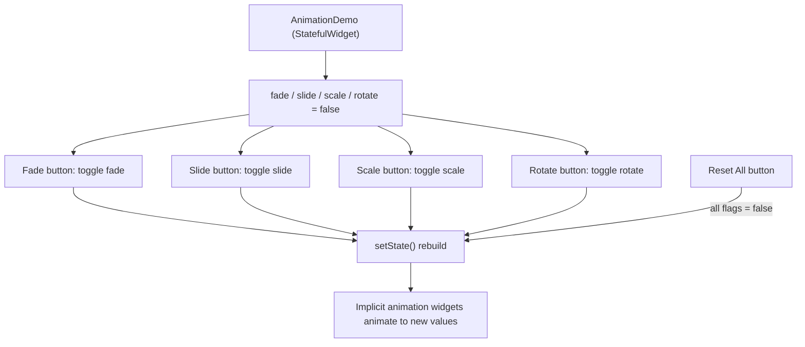

<div align="center">

# ✨ Experiment 8(b) - Different Types of Animations

### Fade &nbsp;•&nbsp; Slide &nbsp;•&nbsp; Scale &nbsp;•&nbsp; Rotation

</div>

[](https://raw.githubusercontent.com/andreasbm/readme/master/assets/lines/rainbow.gif)

# 🎯 Aim

To implement and demonstrate different types of Flutter animations, including fade, slide, scale, and rotation animations, using Flutter's built-in animation widgets.

[](https://raw.githubusercontent.com/andreasbm/readme/master/assets/lines/rainbow.gif)

# 📝 Description

Flutter provides several widgets for creating animations with minimal code. These widgets are examples of Flutter's **implicit animation framework**, in which changes made to their properties are animated automatically.

- The `duration` property specifies how long an animation should take.
- The `curve` property controls the rate at which an animation progresses.
- A `StatefulWidget` is used because the animation properties change when the user interacts with the buttons.
- `setState()` changes the animation values and causes the UI to rebuild.

## 1️⃣ Types of Animations Used

| Animation | Flutter Widget | Effect |
|-----------|----------------|--------|
| 🌫️ Fade | `AnimatedOpacity` | Changes transparency (fade-in and fade-out) |
| ➡️ Slide | `AnimatedSlide` | Moves a widget smoothly from one position to another |
| 🔍 Scale | `AnimatedScale` | Enlarges or reduces the widget |
| 🔄 Rotation | `AnimatedRotation` | Rotates the widget through a specified number of turns |

## 2️⃣ Important Properties

| Property | Purpose |
|----------|---------|
| `duration` | Specifies the animation time |
| `curve` | Controls the animation's motion pattern |
| `opacity` | Controls transparency in `AnimatedOpacity` |
| `offset` | Determines the movement in `AnimatedSlide` |
| `scale` | Determines the size in `AnimatedScale` |
| `turns` | Specifies the number of rotations in `AnimatedRotation` |
| `setState()` | Changes the animation values and triggers the UI update |

## 3️⃣ Program Structure

`AnimationDemo` is a `StatefulWidget` with four `bool` flags (`fade`, `slide`, `scale`, `rotate`), all starting as `false`. Each of the four sections shows a bold title, an animated icon and a button that toggles its flag with `setState()`. All animations last 1 second.

| Section | Widget and Icon | Off state | On state | Curve | Button |
|---------|-----------------|-----------|----------|-------|--------|
| Fade | `AnimatedOpacity`, red `Icons.favorite` (80) | `opacity` 1.0 | `opacity` 0.1 | `easeInOut` | *Fade* |
| Slide | `AnimatedSlide`, orange `Icons.star` (80) | `Offset.zero` | `Offset(1.5, 0)` | `easeInOut` | *Slide* |
| Scale | `AnimatedScale`, blue `Icons.flutter_dash` (70) | `scale` 1.0 | `scale` 1.8 | `elasticOut` | *Scale* |
| Rotation | `AnimatedRotation`, green `Icons.settings` (80) | `turns` 0 | `turns` 1 | `easeInOut` | *Rotate* |

An `OutlinedButton` labelled *Reset All* calls `resetAnimations()`, which sets all four flags back to `false` in a single `setState()`.

> ℹ️ Each animation button toggles its effect: the first press applies it and the next press reverses it. Your theory calls the last button "Reset"; in the code its label is *Reset All*.



> 💻 **Full source code:** [`source_code.dart`](./source_code.dart)

## ✅ Result

Different types of Flutter animations, including fade, slide, scale, and rotation, were successfully implemented and demonstrated.

[](https://raw.githubusercontent.com/andreasbm/readme/master/assets/lines/rainbow.gif)

# 📤 Output

> ⚠️ **Note:** No `output.xxxx` file was supplied. The description below is the expected output provided with the experiment, not a captured recording. A GIF or short screen recording showing each button would fit best here.
>
> The supplied sketch shows each icon beside its button. In the code, the four sections are stacked vertically, each with its own title, icon and button.

The application displays four animated elements:

```text
        Animation Demo

     ❤️       [Fade]
     ⭐       [Slide]
     🦋       [Scale]
     ⚙️       [Rotate]

             [Reset All]
```

Pressing each button produces the corresponding animation:

- **Fade** → icon becomes transparent/visible.
- **Slide** → star moves horizontally.
- **Scale** → Flutter icon grows/shrinks.
- **Rotate** → settings icon rotates.
- **Reset All** → returns all animations to their initial state.

<!--  -->

[](https://raw.githubusercontent.com/andreasbm/readme/master/assets/lines/rainbow.gif)
