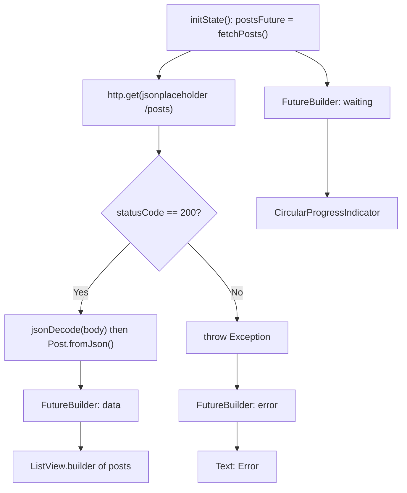

<div align="center">

# 🌍 Experiment 9(a) - Fetch Data from a REST API

### http package &nbsp;•&nbsp; JSON &nbsp;•&nbsp; FutureBuilder

</div>

[](https://raw.githubusercontent.com/andreasbm/readme/master/assets/lines/rainbow.gif)

# 🎯 Aim

To fetch data from a REST API in Flutter using the http package and display the retrieved JSON data in the application.

[](https://raw.githubusercontent.com/andreasbm/readme/master/assets/lines/rainbow.gif)

# 📝 Description

A **REST API** allows an application to communicate with a remote server using HTTP requests. Flutter can use the `http` package to send HTTP requests and receive responses.

## 1️⃣ Key Ideas

- The `http.get()` method sends a GET request to an API endpoint.
- The server response contains data, commonly in JSON format, and `jsonDecode()` converts a JSON response into Dart objects.
- An asynchronous function using `Future` and `async/await` fetches the data.
- The HTTP status code is checked to determine whether the request was successful.
- `FutureBuilder` displays different UI states while asynchronous data is being retrieved. `snapshot.connectionState` indicates whether the request is still running, and `snapshot.hasError` can be used to handle API or network errors.

## 2️⃣ Dependency

Add the `http` package to `pubspec.yaml`:

```yaml
dependencies:
  flutter:
    sdk: flutter
  http: ^1.5.0
```

Then run:

```bash
flutter pub get
```

## 3️⃣ Important Concepts

| Concept | Purpose |
|---------|---------|
| `http.get()` | Sends an HTTP GET request |
| `Response` | Contains the server response |
| `jsonDecode()` | Converts JSON text into Dart objects |
| `async/await` | Handles asynchronous operations |
| `Future` | Represents a value available in the future |
| `FutureBuilder` | Builds UI based on `Future` state |
| `ListView.builder` | Displays API data efficiently |
| `fromJson()` | Converts JSON data into a Dart model |

## 4️⃣ Program Structure

In this experiment, a sample REST API (`https://jsonplaceholder.typicode.com/posts`) is used to retrieve a list of posts.

- The `Post` model class has `id`, `title` and `body`, and a `Post.fromJson()` factory that builds a `Post` from a JSON map.
- `fetchPosts()` sends `http.get()` to the URL. If `statusCode == 200`, it decodes the body with `jsonDecode()` and maps each item to a `Post`. Otherwise it throws an `Exception` with the message *Failed to load posts. Status code: N*.
- `_PostsScreenState` stores the result in `postsFuture`, assigned once in `initState()`.
- A `FutureBuilder<List<Post>>` builds the UI from the snapshot:

| State | Condition | UI shown |
|-------|-----------|----------|
| ⏳ Loading | `connectionState == ConnectionState.waiting` | Centered `CircularProgressIndicator` |
| ❌ Error | `snapshot.hasError` | Centered text *Error: ...* |
| 📭 Empty | No data or empty list | Centered text *No data available.* |
| ✅ Success | Data received | `ListView.builder` of `Card`/`ListTile` items: post `id` in a `CircleAvatar`, bold `title`, and `body` as the subtitle |



> ℹ️ The request needs an internet connection. If it fails, the app shows the error message. The empty-state message is an extra case handled in the code that your theory does not mention.

> 💻 **Full source code:** [`source_code.dart`](./source_code.dart)

## ✅ Result

Data was successfully fetched from a REST API, converted from JSON into Dart objects, and displayed in a Flutter application.

[](https://raw.githubusercontent.com/andreasbm/readme/master/assets/lines/rainbow.gif)

# 📤 Output

> ⚠️ **Note:** No `output.xxxx` file was supplied. The description below is the expected output provided with the experiment, not a captured screenshot. Add a screenshot of the post list here once available. I have not run the request, so the post text shown is the sample you supplied.

After launching the application, it fetches posts from the REST API and displays them in a list:

```text
REST API Data

┌───────────────────────────────┐
│  1   sunt aut facere...       │
│      quia et suscipit...      │
├───────────────────────────────┤
│  2   qui est esse             │
│      est rerum tempore...     │
├───────────────────────────────┤
│  3   ea molestias quasi...    │
│      et iusto sed...          │
└───────────────────────────────┘
```

While the data is being fetched, a `CircularProgressIndicator` is displayed. If the request fails, an error message is shown.

<!--  -->

[](https://raw.githubusercontent.com/andreasbm/readme/master/assets/lines/rainbow.gif)
