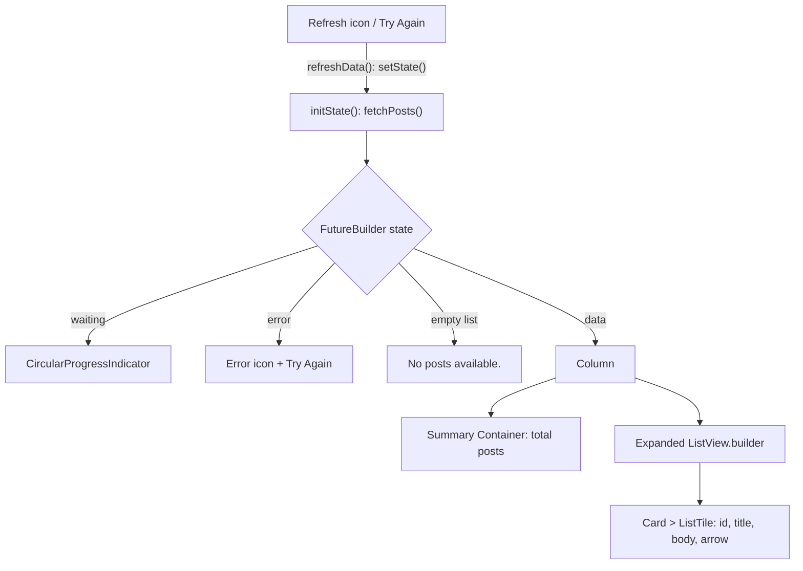

<div align="center">

# 🗂️ Experiment 9(b) - Display Fetched Data in a Meaningful Way

### Cards &nbsp;•&nbsp; Lists &nbsp;•&nbsp; Icons &nbsp;•&nbsp; Structured Layouts

</div>

[](https://raw.githubusercontent.com/andreasbm/readme/master/assets/lines/rainbow.gif)

# 🎯 Aim

To retrieve data from a REST API and display it in a meaningful and user-friendly Flutter interface using cards, lists, icons, and structured layouts.

[](https://raw.githubusercontent.com/andreasbm/readme/master/assets/lines/rainbow.gif)

# 📝 Description

Data received from a REST API is usually available in JSON format. The JSON response can be converted into Dart model objects using `jsonDecode()`, and the `http` package is used to make the API request. This approach converts raw API data into a readable and user-friendly interface.

## 1️⃣ Dependency

Add the `http` package to `pubspec.yaml`:

```yaml
dependencies:
  flutter:
    sdk: flutter
  http: ^1.5.0
```

Then run:

```bash
flutter pub get
```

## 2️⃣ Widgets and Concepts

| Widget / Concept | Purpose |
|------------------|---------|
| `FutureBuilder` | Manages the asynchronous API response and handles its states |
| `ListView.builder` | Displays multiple records efficiently |
| `Card` | Visually groups each record |
| `ListTile` | Provides a structured list-item layout (title, subtitle, trailing widget) |
| `CircleAvatar` | Displays the post number as a visual identifier |
| `Expanded` | Uses the available screen space |
| `jsonDecode()` | Converts JSON into Dart data |
| `setState()` | Refreshes the API data |

## 3️⃣ Program Structure

The program requests `https://jsonplaceholder.typicode.com/posts`. `fetchPosts()` throws an `Exception` (*Unable to fetch data. Status: N*) for any status code other than 200, then decodes the body and converts each item with `Post.fromJson()` (`id`, `title`, `body`).

`refreshData()` assigns a new `fetchPosts()` future inside `setState()`. It is used by the refresh icon in the `AppBar` and by the *Try Again* button.

The `FutureBuilder` shows one of four states:

| State | UI shown |
|-------|----------|
| ⏳ Loading | Centered `CircularProgressIndicator` |
| ❌ Error | Error icon, text *Unable to load posts.* and a *Try Again* `ElevatedButton` |
| 📭 Empty | Centered text *No posts available.* |
| ✅ Success | Summary card plus the post list (below) |

**✅ Success layout** (a `Column`):

1. **Summary section** — a rounded `Container` (`primaryContainer` color) with an article icon, the label *Available Posts* and the total number of retrieved posts (`posts.length`, font size 28, bold).
2. **Post list** — an `Expanded` `ListView.builder` where each post is a `Card` (elevation 3) with a `ListTile`:
   - **leading:** `CircleAvatar` with the post `id`
   - **title:** the post title in **uppercase** (`toUpperCase()`), bold, up to 2 lines
   - **subtitle:** the post body, up to 3 lines, cut with an ellipsis
   - **trailing:** an `Icons.arrow_forward_ios` icon



> ℹ️ Your concepts table lists *SnackBar*, but the program does not use a `SnackBar`. Errors are shown in the error UI. The refresh icon and the *Try Again* button appear in the code, though the theory does not describe them.

> 💻 **Full source code:** [`source_code.dart`](./source_code.dart)

## ✅ Result

The fetched REST API data was successfully presented in a meaningful, structured, and user-friendly Flutter interface.

[](https://raw.githubusercontent.com/andreasbm/readme/master/assets/lines/rainbow.gif)

# 📤 Output

> ⚠️ **Note:** No `output.xxxx` file was supplied. The description below is the expected output provided with the experiment, not a captured screenshot. Add screenshots of the loaded list (and, if wanted, the error state) here once available. I have not run the request, so the count *100* and the post text are the values in your sketch.
>
> In your sketch the post body lines are in capitals, but the code uppercases only the title. The body is shown as received.

After successfully fetching the API data, the application displays a meaningful interface similar to:

```text
┌─────────────────────────────────┐
│ Posts                     ⟳     │
├─────────────────────────────────┤
│  📄   Available Posts            │
│       100                        │
├─────────────────────────────────┤
│  1   SUNT AUT FACERE...      >  │
│      QUIA ET SUSCIPIT...        │
├─────────────────────────────────┤
│  2   QUI EST ESSE            >  │
│      EST RERUM TEMPORE...       │
├─────────────────────────────────┤
│  3   EA MOLESTIAS QUASI...   > │
│      ET IUSTO SED...            │
└─────────────────────────────────┘
```

The refresh icon allows the user to fetch the latest data again. Loading, error, and empty-data states are also handled appropriately.

<!--  -->

[](https://raw.githubusercontent.com/andreasbm/readme/master/assets/lines/rainbow.gif)
